# Career Semi Quant Terminal — Complete Documentation

> **Who is this for?** Everyone — from someone who has never bought a stock, to a software engineer evaluating RSU packages, to an experienced quant researcher. Every metric is explained from first principles with simple analogies, precise mathematics, real stock plots, and semiconductor examples.

---

## Table of Contents

1. [Introduction — Why Quant Analytics?](#1-introduction)
2. [The Main Price Chart — SMA & Bollinger Bands](#2-main-price-chart)
3. [Fear & Greed Gauge](#3-fear--greed-gauge)
4. [Risk Metrics Grid](#4-risk-metrics-grid)
5. [Advanced Quant Analytics](#5-advanced-quant-analytics)
6. [S&P 500 Benchmarking Grid](#6-sp-500-benchmarking-grid)
7. [Quant & Trading Grid](#7-quant--trading-grid)
8. [Detail Modal — 9 Charts Explained](#8-detail-modal--9-charts)
9. [Extended Metrics Grid (25 metrics)](#9-extended-metrics-grid)
10. [Universe Risk Map](#10-universe-risk-map)
11. [Universe Correlation Heatmap](#11-universe-correlation-heatmap)
12. [The Monte Carlo Engine (Merton Jump-Diffusion)](#12-the-monte-carlo-engine)
13. [Statistical Foundations Appendix](#13-appendix--statistical-foundations)
14. [Quick-Reference Cheat Sheet](#14-quick-reference-cheat-sheet)

---

## 1. Introduction

### Why does quantitative analysis matter?

Imagine you are choosing between two job offers. Both offer RSUs. Company A's stock went up **200%** last year. Company B's stock went up **80%**. Which is better?

If you said Company A — you might be wrong. A stock with an incredibly high peak might have crashed right after, while a stock with steady growth provides real, reliable value. Quantitative analysis reveals the full picture that raw return numbers hide.

### How the terminal works

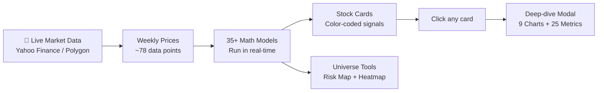
```mermaid
flowchart LR
    A[📡 Live Market Data\nYahoo Finance / Polygon] --> B[Weekly Prices\n~78 data points]
    B --> C[35+ Math Models\nRun in real-time]
    C --> D[Stock Cards\nColor-coded signals]
    D --> E[Click any card]
    E --> F[Deep-dive Modal\n9 Charts + 25 Metrics]
    C --> G[Universe Tools\nRisk Map + Heatmap]
```

### Why Weekly Prices?

- **Daily prices** → Too noisy (market noise, HFT). Jagged and hard to read trends.
- **Weekly prices** → Clean signal, 52–78 data points per 1.5 years ✅. Clear trends visible.
- **Monthly prices** → Too few data points (only ~18). Not enough for robust statistics.

---

## 2. Main Price Chart

### What you see

The large chart in every stock's detail modal shows three things:

- 🔵 **Blue line** — actual weekly closing price
- 🟡 **Gold dashed line** — 40-Week Simple Moving Average (SMA40)
- ⬜ **Faint white band** — Bollinger Bands (20-week, ±2 standard deviations)


---

### 2.1 Simple Moving Average (SMA)

**Simple explanation — The smoothing iron:**
Imagine you're tracking your daily step count. Instead of looking at each day's jagged numbers, you average the last 10 days. The bumps smooth out, and you can see the real trend. That's a moving average.

**Mathematical definition:**

```
SMA(n) at time t = (P[t] + P[t-1] + ... + P[t-n+1]) / n
```

Where `P[t]` is the closing price at week `t`, and `n` is the window size.

**The Two SMAs: The Speedboat and the Ocean Liner**

To understand why we use two different moving averages, imagine two boats navigating a winding river:

- 🚤 **SMA10 (10-Week / The Speedboat):** This only averages the last 10 weeks of prices. Because it carries very little historical "weight", it is incredibly agile. When the stock's price changes direction, the SMA10 turns very quickly to follow it. It tells you exactly what momentum is doing *right now*.
- 🚢 **SMA40 (40-Week / The Ocean Liner):** This averages the last 40 weeks (almost a full year). Because it carries so much historical data, it turns very slowly. It completely ignores short-term noise and weekly panics. It tells you the *long-term, structural trend* of the stock.

**Why do we care when they cross?**
When the stock price starts going up, the agile speedboat (SMA10) catches the uptrend immediately and begins rising. The massive ocean liner (SMA40) takes much longer to react. 

When the SMA10 finally crosses *above* the SMA40, it serves as mathematically confirmed proof that the new trend is strong enough to actually turn the ocean liner around. This is a massive signal!

**Bull/Bear Cross Signal — how it works:**

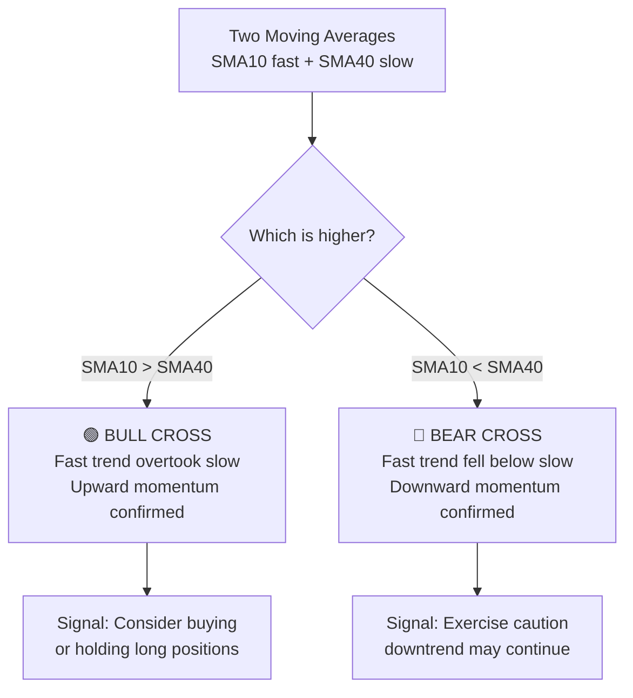
```mermaid
flowchart TD
    A[Two Moving Averages\nSMA10 fast + SMA40 slow] --> B{Which is higher?}
    B -->|SMA10 > SMA40| C[🟢 BULL CROSS\nFast trend overtook slow\nUpward momentum confirmed]
    B -->|SMA10 < SMA40| D[🔴 BEAR CROSS\nFast trend fell below slow\nDownward momentum confirmed]
    C --> E[Signal: Consider buying\nor holding long positions]
    D --> F[Signal: Exercise caution\ndowntrend may continue]
```

> [!TIP]
> The Bull Cross in February 2023 for NVDA (shown in the chart above) preceded a massive run. The signal doesn't predict *how far* — it confirms the trend has shifted direction.

---

### 2.2 Bollinger Bands

**Simple explanation — The mood ring:**
If someone's test scores average 75, and they almost never score below 60 or above 90, then a score of 95 today is *statistically unusual* — it'll probably drift back. Bollinger Bands apply this reasoning to stock prices.

**Mathematical definition:**

```
Middle Band  = SMA(20)
Upper Band   = SMA(20) + 2 × σ(20)     ← 2 standard deviations above
Lower Band   = SMA(20) − 2 × σ(20)     ← 2 standard deviations below
```

Where `σ(20)` = standard deviation of the last 20 weekly closes.

**Reading guide:**

| Price Location | What it means | Action signal |
|---------------|---------------|---------------|
| Touches upper band | Statistically expensive | Watch for reversal OR riding a strong trend |
| Touches lower band | Statistically cheap | Watch for bounce / contrarian buy |
| Bands expanding | Volatility increasing | Uncertainty rising — big moves ahead |
| **Bands squeezing** | **Volatility compressing** | **⚡ Large move imminent — direction unknown** |
| Price rides upper band for weeks | Very strong uptrend | Don't sell just because it looks "expensive" |

**In-Depth Explanation of Bollinger Band Scenarios:**

1. **Touches the Upper Band (Statistically Expensive):** The upper band is placed 2 standard deviations above the average. Statistically, 95% of the time, the price should stay *below* this line. When it touches or crosses it, the stock has gone up unusually fast. It might be exhausted and ready to pull back down to the average (a reversal).
2. **Touches the Lower Band (Statistically Cheap):** The opposite scenario. The stock has fallen unusually fast and is sitting at the bottom of its statistical range. Fear might be overblown here, making it a "contrarian" buy opportunity because a bounce back up to the average is statistically very likely.
3. **Bands Expanding (Volatility Increasing):** The bands widen when the stock starts making huge, wild swings. This means the market is suddenly very uncertain about the company's true value (often happens around earnings reports or major news). Big, unpredictable moves are actively happening.
4. **Bands Squeezing (Volatility Compressing):** This happens when the stock has been trading flat in a very tight, boring range for a long time. The bands get extremely narrow. Think of a coiled spring being pushed down tightly. Eventually, the pressure has to release. A "squeeze" warns you that a massive, explosive move is coming very soon (though it doesn't tell you if it will explode up or down).
5. **Price Rides Upper Band for Weeks:** Usually, touching the upper band means the stock is "too expensive" and will fall. But sometimes, in incredibly powerful bull markets (like NVDA during the AI boom), the price just locks onto the upper band and keeps riding it higher week after week. If the stock is riding the upper band *while* the band itself is pointing sharply upward, it means momentum is overwhelmingly strong. Selling here just because it "looks high" is a common mistake that makes you miss out on massive gains.

---

### 2.3 MACD (Moving Average Convergence Divergence)

**Simple explanation — The Rubber Band and the Two Runners:**

Imagine two runners tied together by a giant rubber band running on a track.
1. **The Fast Runner (12-Week Average):** Represents the stock's most recent, energetic moves.
2. **The Slow Runner (26-Week Average):** Represents the stock's older, slower trend.

The **MACD Line** is simply the distance between these two runners (the stretch of the rubber band). When the Fast Runner sprints ahead, the distance grows. 

But just knowing the distance isn't enough; we need to know if the Fast Runner is *speeding up* or *getting tired*. So we calculate one more thing:
- **The Signal Line:** This is the *average* distance between the runners over the last 9 weeks. It acts as a baseline of what is "normal" momentum.

Finally, we compare the current stretch (MACD Line) to the average stretch (Signal Line). This difference is drawn as the **MACD Histogram** (the colored bars you see at the bottom of the chart):

- **Histogram > 0 (Bars going up) 🟢:** The Fast Runner is pulling away *faster* than average. Momentum is surging. This is a **Bullish** signal!
- **Histogram < 0 (Bars going down) 🔴:** The Fast Runner is getting tired and falling back toward the Slow Runner. Momentum is fading. This is a **Bearish** signal!

**Why it matters:**
Stock prices can sometimes still be going up while the MACD Histogram starts going down. This is an early warning that the stock is "running out of gas" *before* the price actually falls!

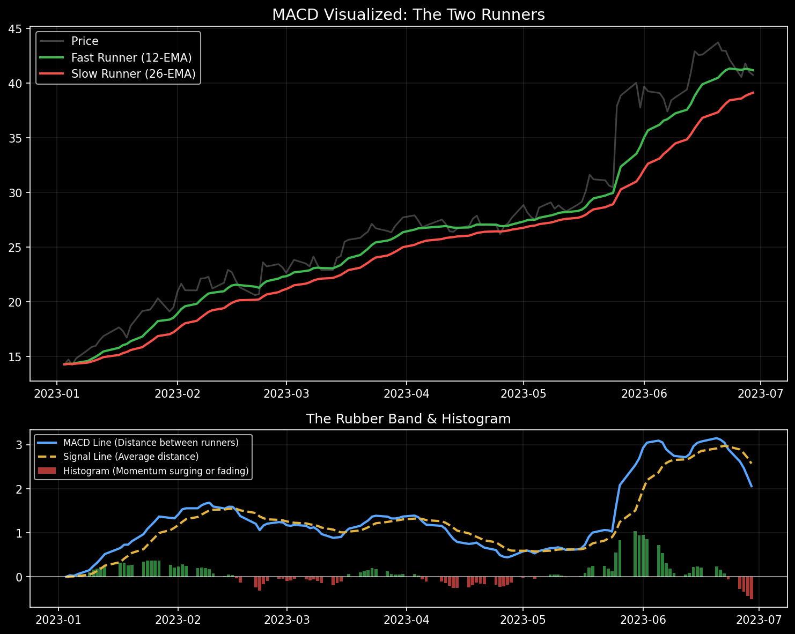

---

## 3. Fear & Greed Gauge

### Simple explanation — The crowd at an auction

Think of the stock market as an auction where crowd emotion drives bids. When everyone is terrified (FEAR), they dump assets at any price — historically great buying opportunities. When everyone is euphoric (GREED), they overbid for everything — dangerous for new buyers.

### The Formula

```
FearGreed = (RSI + Stochastic + VolScore) / 3

VolScore = clamp(100 − (AnnualVol% − 15) × 1.5, 0, 100)
```

**What are these three ingredients? (Explained for Beginners)**

1. **RSI (Relative Strength Index): The "Fatigue" Meter**
   Imagine a runner sprinting at full speed. No matter how fit they are, eventually, they will get tired and have to slow down. RSI measures this for a stock. If a stock surges up day after day without resting, its RSI climbs toward 100 ("Overbought" or GREED). If it crashes straight down, RSI drops near 0 ("Oversold" or FEAR). It tells us when a stock has moved too far, too fast, and is due for a break.

2. **Stochastic Oscillator: The "Where are we in the room?" Meter**
   Imagine a room with a floor at 0 feet and a ceiling at 10 feet. If a balloon is floating at 9.5 feet, it's almost touching the ceiling. Stochastic simply asks: "Looking at the highest and lowest prices over the last few months, where is today's price?" 
   - Near 100: The stock is hovering right at its recent "ceiling" (GREED).
   - Near 0: The stock is scraping its recent "floor" (FEAR).

3. **VolScore: The "Panic" Meter**
   When investors are confident, prices move smoothly. When they are terrified, they panic-sell, causing wild, violent price swings (high volatility). 
   We take this Volatility and flip it upside down to make the `VolScore`. So:
   - High Volatility (wild price swings) = Low VolScore = FEAR.
   - Low Volatility (smooth sailing) = High VolScore = GREED.

**How they combine:**

Instead of looking at three different numbers, the terminal just averages them together to give you one master reading from 0 to 100:

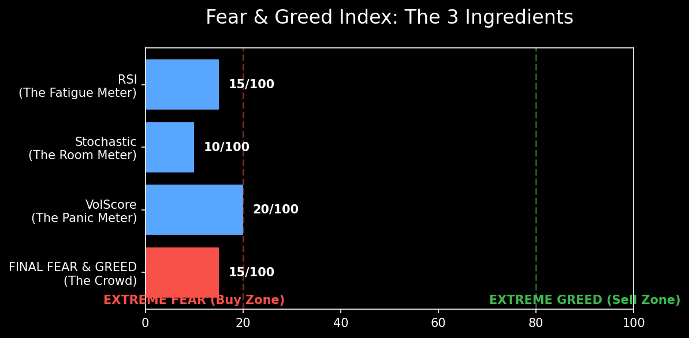

- **0-25 (EXTREME FEAR / Buy Zone):** Panic selling. Everyone is dumping the stock. Historically the best time to buy.
- **25-45 (FEAR):** Cautious pessimism.
- **45-55 (NEUTRAL):** Normal, calm trading.
- **55-75 (GREED):** Bullish optimism. Caution advised for new buyers.
- **75-100 (EXTREME GREED / Sell Zone):** Pure euphoria. Everyone is buying the stock regardless of price. Usually a terrible time to buy, and a great time to take profits.

**Step-by-step worked example — NVDA at trough:**

```
Input data (October 2022):
  RSI           = 28   (oversold — stock fell too hard, too fast)
  Stochastic    = 15   (price at bottom of 14-week range)
  Annual Vol    = 78%  → VolScore = 100 − (78−15)×1.5 = 100 − 94.5 = 5.5

Calculation:
  FearGreed = (28 + 15 + 5.5) / 3 = 48.5 / 3 = 16.2

Result: 16.2 → EXTREME FEAR 🔴 ← Perfect contrarian buy signal!
```

---

## 4. Risk Metrics Grid

These answer the fundamental question: **what can go wrong, and how bad?**

---

### 4.1 Max Drawdown (MaxDD)

**Simple explanation — The worst-case investor:**
"If I had the absolute worst timing — buying exactly at the peak and selling exactly at the bottom — how much money would I have lost?" That is Max Drawdown.

**Mathematical definition:**

```
MaxDD = min over all time t of:
        (P[t] − max(P[0..t])) / max(P[0..t]) × 100
```


An employee who received AMD RSUs in Nov 2021 watched their equity lose 68% of its value by Oct 2022. That's a 4-year vesting cliff that started deeply underwater.

> [!IMPORTANT]
> MaxDD answers: "How deep was the worst hole?" — but it doesn't answer "How long did I sit in that hole?" For that, see **Ulcer Index** (Section 5.6) and **DD Duration** (Section 9.12).

---

### 4.2 Value at Risk — VaR 95% (Weekly Parametric)

**Simple explanation — The Worst-Case Weather Forecast:**

Imagine a weatherman says: *"I am 95% confident that it will rain LESS than 2 inches tomorrow."* 
This means there is only a 5% chance (1 out of 20 days) that it rains *more* than 2 inches.

VaR does the exact same thing for losing money. If a stock's weekly VaR 95% is **-8%**, it means: *"We are 95% confident that your worst loss in a normal week will not exceed 8%."*
Or flipped around: **1 out of every 20 weeks, you should expect to lose MORE than 8%.**

**How it's calculated (The "Bell Curve" method):**
Instead of using confusing math formulas, think of it like grading on a curve in school:
1. We find the stock's "average" weekly return.
2. We measure how much it normally bounces around.
3. We assume these bounces form a perfect, smooth, symmetrical Bell Curve.
4. We look at the absolute worst 5% slice at the very bottom of that curve to get our final VaR number.

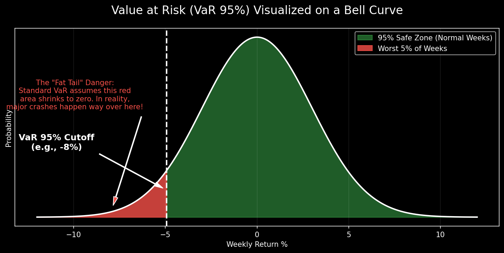

> [!WARNING]
> **The "Fat Tail" Danger:**
> This standard VaR model assumes stock crashes happen just as predictably as test scores fall on a perfect bell curve. **They don't.** 
> Real stock markets have "Fat Tails" — meaning extreme, catastrophic crashes (like 2008 or 2020) happen much more often, and are much worse, than a smooth bell curve predicts. If you only look at standard VaR, you might be underestimating the danger of a true panic. (Because of this, we also use "CF mVaR" in Section 5.1, which mathematically adjusts for these real-world extreme crashes!)

---

### 4.3 Sortino Ratio

**Simple explanation — Forgiving the "Good" Surprises:**

Remember the Sharpe Ratio? It has one massive flaw: it treats ALL bounciness as "Risk". If a stock suddenly jumps UP 50% because of an amazing earnings report, the Sharpe Ratio actually gets *worse* because the stock became more volatile! But as an investor, you love when stocks jump up; you only hate when they crash down.

The **Sortino Ratio** fixes this. It ignores the "good bounciness" (upside volatility) and only punishes the "bad bounciness" (downside volatility).

**What goes into the Sortino Ratio?**

It is a simple fraction: **Reward ÷ Bad Risk**. Here are the two ingredients:

1. **The Reward (Return minus Risk-Free Rate):** 
   Just like Sharpe, it asks: *"How much extra money did I make by holding this risky stock instead of just leaving my cash in a completely safe, boring bank savings account?"*

2. **The Penalty (Downside Deviation):** 
   This is the genius part. The formula looks at every single week of the year:
   - If the stock went **UP** that week, the formula completely ignores it. (Good surprises aren't risk!)
   - If the stock went **DOWN** that week, the formula takes that percentage loss, *squares it* (which mathematically punishes massive crashes much, much harder than tiny dips), and throws it into a "Penalty Pile".
   - It then divides that Penalty Pile by the *total* number of weeks to find your average "Downside Risk".

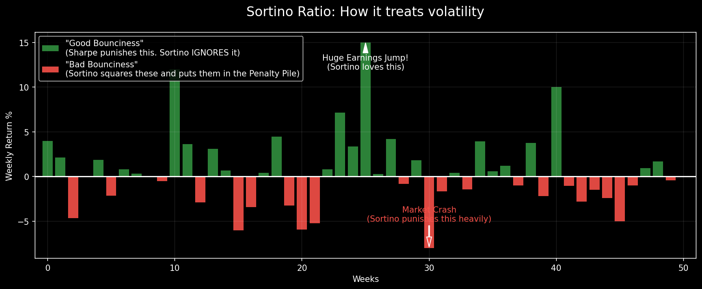

**Why it's better for tech/semiconductor stocks:**
Stocks like NVDA or AMD have massive upside explosions. The Sharpe Ratio makes them look artificially risky. Sortino correctly rewards them for making you money, while only measuring the actual pain of their crashes.

**How to read it:**
- **< 1.0:** Poor. You are taking too much downside damage for the returns you get.
- **1.0 – 2.0:** Good. A solid, healthy investment.
- **> 2.0:** Incredible. You are generating massive returns with very little downside pain.

---

### 4.4 RSI (Relative Strength Index) — shown in tech bar

**Simple explanation — The Tug of War:**
Imagine a massive tug of war between Bulls (buyers) and Bears (sellers). 
Every week the stock goes up, the Bulls pull the rope towards their side. Every week it goes down, the Bears pull it back.

RSI simply measures who is winning this tug of war over the last 14 weeks, and by how much, on a scale from 0 to 100.
- If the stock goes up almost every week, the Bulls have pulled the rope all the way to their side. The RSI will be near 100. But the Bulls are now exhausted ("Overbought"), and the Bears will easily pull it back.
- If the stock crashes week after week, the Bears have the rope near 0. But they are exhausted ("Oversold"), and the Bulls are ready to take over.

**How to read it:**
- **> 75 (🔴 Overbought):** Bulls are exhausted. The stock rose too fast and is due for a pullback. Take profits or use caution.
- **55–75 (🟢 Bullish):** Strong, healthy uptrend. Ride the momentum.
- **45–55 (⚪ Neutral):** The tug of war is perfectly tied. No clear trend.
- **30–45 (🟡 Weak):** Bears are in control. Wait for a signal.
- **< 30 (🟢 Oversold):** Bears are completely exhausted. The stock fell too fast. Watch closely for a "contrarian" bounce back up!

---

### 4.5 Stochastic Oscillator — shown in tech bar

**Simple explanation — The Floor and the Ceiling:**

Imagine you are tracking the price of a house over the last 14 weeks. 
- The absolute highest price anyone paid was **$1,000,000** (The Ceiling).
- The absolute lowest price anyone paid was **$500,000** (The Floor).

If the house sells today for **$900,000**, where does that sit between the floor and the ceiling? It is 80% of the way up.

The **Stochastic Oscillator** does exactly this for stocks. It skips all the complicated averages and math. It simply finds the highest peak and the lowest valley of the last 14 weeks, and tells you exactly where today's price sits on a scale of 0 to 100.

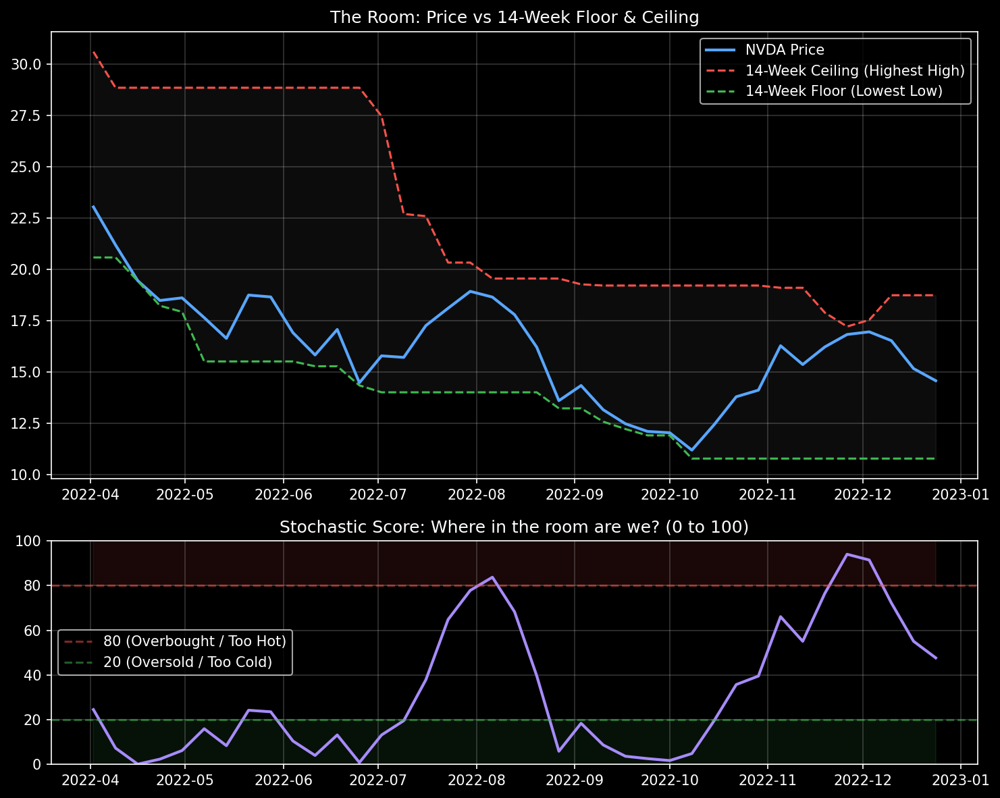

**How to read it:**
- **> 80 (Overbought / Too Hot):** The stock is pushing right against its 14-week ceiling. Buyers are usually exhausted here, and the price is statistically likely to bounce back down.
- **< 20 (Oversold / Too Cold):** The stock is scraping the absolute bottom of its 14-week floor. Panic sellers are exhausted, making it a prime spot for the stock to bounce back up.
- **Around 50:** The stock is floating comfortably right in the middle of the room.

---

## 5. Advanced Quant Analytics

These appear in the lower section of the risk grid — color-coded purple/cyan to distinguish from basic metrics.

---

### 5.1 Cornish-Fisher Modified VaR (CF mVaR 95%)

**Simple explanation — Fixing the Bell Curve Lie:**

Earlier in Section 4.2, we used a standard Bell Curve to predict our worst-case losses (VaR). Look at the chart below for NVDA:


The smooth white line is the perfect, mathematical Bell Curve. The blue bars are what *actually happened* in the real world. 
Notice two massive problems with the real world (the blue bars):
1. **The Leaning Tower (Skewness):** The blue bars aren't perfectly symmetrical. They lean slightly to one side.
2. **The Fat Tails (Kurtosis):** Look at the far left edge of the chart. The white line drops to basically zero, claiming that extreme crashes are mathematically "impossible." But there are blue bars way out there! These extreme, catastrophic crashes happen much more often than theory predicts. We call these **Fat Tails**.

If you only use the standard Bell Curve VaR, it will tell you those extreme crashes don't exist. You will feel falsely safe.

**What does CF mVaR do?**
Cornish and Fisher were two statisticians who created a brilliant fix. Instead of forcing the stock to fit a perfect bell curve, their formula mathematically bends, twists, and stretches the curve to match the *actual* blue bars. 

The result is a much more honest, real-world estimate of your worst-case scenario. If a stock has a history of catastrophic "Fat Tail" crashes, CF mVaR will be significantly worse (more negative) than standard VaR, warning you of the true danger.

> [!IMPORTANT]
> When evaluating a highly volatile tech stock or RSU package, **always** look at the CF mVaR instead of standard VaR. Standard VaR will hide the extreme dangers.

---

### 5.2 Jarque-Bera Test (JB Statistic)

**Simple explanation — The Normality Smoke Alarm:**
The Jarque-Bera (JB) test is like a mathematical smoke alarm. It calculates exactly how badly the real-world data (the bars) miss the theoretical, safe Bell Curve (the white line). 

If the bars fit the white line perfectly, the JB score is 0. As the "Fat Tails" get larger and more dangerous, the JB score explodes higher.

Here is what different JB scores actually look like:

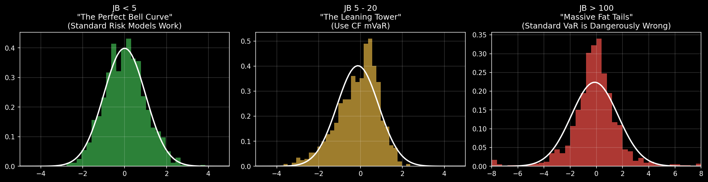

**How to use this score:**
When analyzing a stock, check its JB score first to know if you can trust standard risk models:

| JB Score | What the chart looks like | What it means for you | Real Example |
|----------|-------------------------|------------------------|--------------|
| **< 5** | The Perfect Bell Curve | Very safe to use standard VaR. | COHR (JB = 2.5) |
| **5 – 20** | The Leaning Tower | The curve is skewed. Standard VaR is slightly off. You must use CF mVaR. | TSMC (JB = 9.1) |
| **20 – 100** | Fat Tails Appearing | Dangerous. Extreme crashes happen more often. Standard VaR will lie to you. | MTSI (JB = 56.4) |
| **> 100** | Massive Fat Tails | Highly dangerous and unpredictable. Massive crashes are common. | MXL (JB = 145) |

---

### 5.3 Omega Ratio

**Simple explanation — The Totals Ledger:**

Every risk metric we've discussed so far (VaR, Sharpe, Sortino) uses complicated statistical math like "standard deviations" or "bell curves".

The **Omega Ratio** says: *Forget the fancy math. Let's just look at the actual money.*

Imagine keeping a ledger for the entire year:
1. Every week you make money, you throw those percentage gains into the **Green Bucket**.
2. Every week you lose money, you throw those percentage losses into the **Red Bucket**.

At the end of the year, you weigh the two buckets against each other.

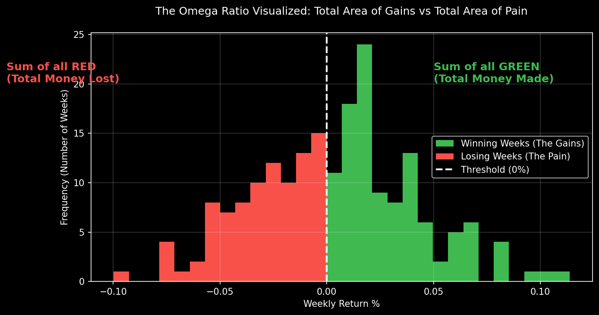

**The Formula (In Plain English):**
`Omega Ratio = Total Area of the Green Bucket ÷ Total Area of the Red Bucket`

**Why it is so powerful:**
Because it doesn't use standard deviations or bell curves, it automatically catches extreme "Fat Tail" crashes. If a stock has a bunch of small winning weeks but one utterly catastrophic crashing week, the Red Bucket will be massive, and the Omega Ratio will be terrible. It cannot be fooled by tricky statistics.

**How to read it:**
- **< 1.0 (🔴 Losing Money):** Your Red Bucket is heavier than your Green Bucket. 
- **1.0 – 1.5 (⚪ Average):** You are making more than you lose, but it's a grind.
- **> 1.5 (🟢 Excellent):** Your Green Bucket is massively outweighing your Red Bucket.

---

### 5.4 Hurst Exponent

**Simple explanation — The Rubber Band, The Drunkard, or The Snowball?**

If you flip a fair coin (Heads = stock goes up, Tails = stock goes down), the result of the next flip has absolutely nothing to do with the last flip. That is a pure, unpredictable "Random Walk."

But real stocks are not always random. The **Hurst Exponent (H)** mathematically measures the "memory" of a stock. Does it remember what it did last week, and does that memory make it want to reverse or keep going?

Here are the three types of stocks:

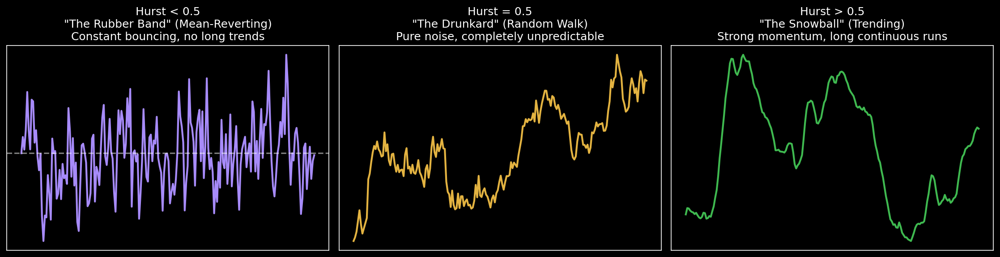

**1. H < 0.45 (The Rubber Band / Mean-Reverting):**
If this stock goes up, it feels stretched and immediately wants to snap back down. If it drops, it snaps back up. It is constantly bouncing and trapped in a range. 
*Strategy:* Buy the dips, sell the rips. Don't expect a long-term trend.

**2. H around 0.50 (The Drunkard / Random Walk):**
Like a drunk person stumbling in a field, every step is totally random. The stock has zero memory. Knowing what happened last week tells you absolutely nothing about next week.
*Strategy:* Passive investing. You cannot predict its next move.

**3. H > 0.55 (The Snowball / Trending):**
Pure momentum! A snowball rolling down a hill just gets bigger and faster. If this stock went up last week, it is mathematically more likely to go up *again* this week. 
*Strategy:* Ride the trend. Don't fight it. (Think: NVDA during the massive AI boom).

---

### 5.5 Autocorrelation (Lag-1)

**Simple explanation — Does history repeat next week?**
If last week was a great week (+8%), does that tell you anything about *this* week? Autocorrelation measures exactly this "cause and effect" relationship between consecutive weeks.

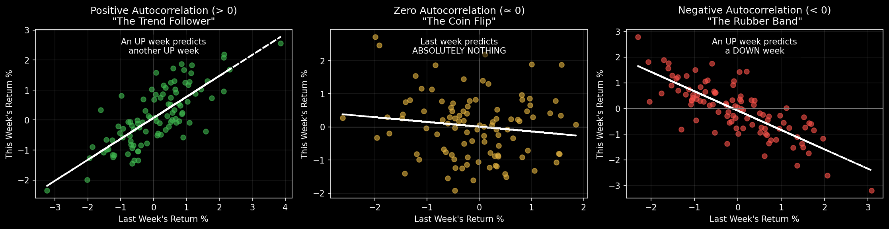

**How to read it:**
- **> 0 (Positive / Momentum):** If it went up last week, it is mathematically more likely to go up again this week. The trend is your friend.
- **Around 0 (Random):** Last week tells you absolutely nothing. It's a coin flip.
- **< 0 (Negative / Reversal):** If it went up last week, it is very likely to drop this week. It bounces back and forth like a rubber band.

---

### 5.6 Ulcer Index

**Simple explanation — The Chronic Pain Meter:**
Max Drawdown (Section 4.1) tells you *how deep* the worst crash was. But it ignores how long you were trapped at the bottom. 
The **Ulcer Index** measures *how long* you suffered. 

Peter Martin (who invented it in 1987) named it perfectly — it is the prolonged, grinding, multi-month drawdowns that give investors stomach ulcers.

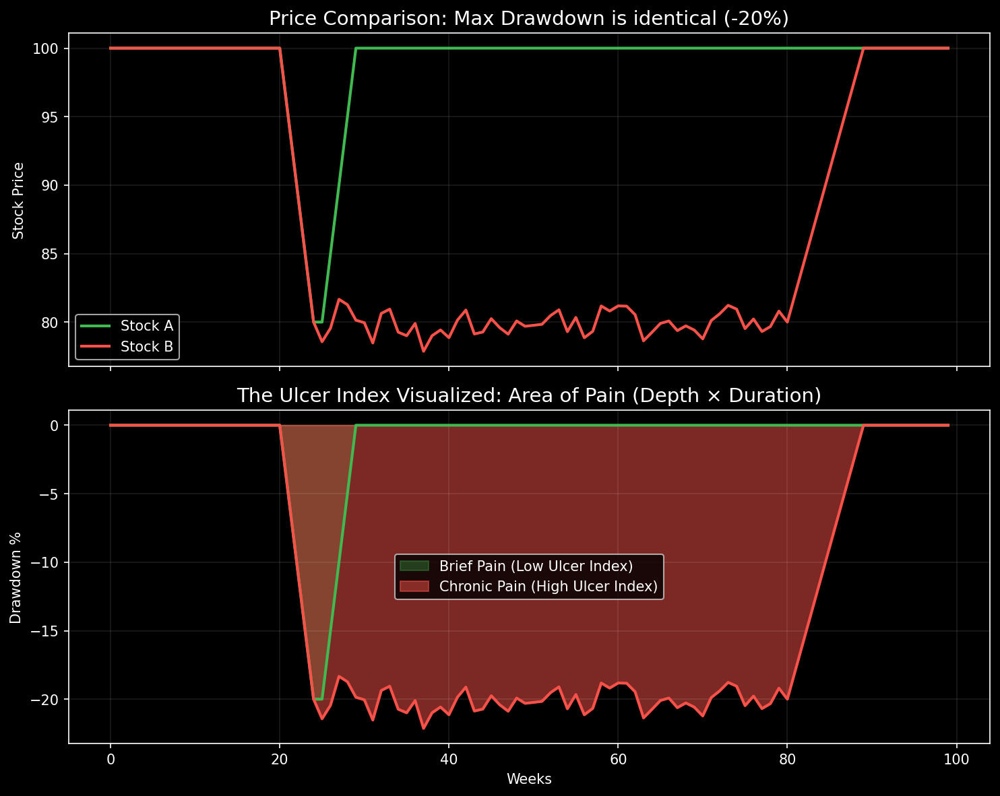

**Why it matters:**
Stock A crashes 20% but recovers fully in 2 weeks. (Brief pain, low Ulcer Index).
Stock B crashes 20% and stays trapped at the bottom for an entire year. (Chronic pain, high Ulcer Index).
If you only look at Max Drawdown, both stocks look exactly the same (-20%). The Ulcer Index exposes Stock B as the far more painful, psychologically exhausting investment.

---

### 5.7 Tail Ratio

**Simple explanation — The Battle of the Extremes:**

If you ignore all the "normal" weeks and only look at the most extreme, chaotic weeks of the year: are the massive winning weeks bigger than the massive losing weeks?

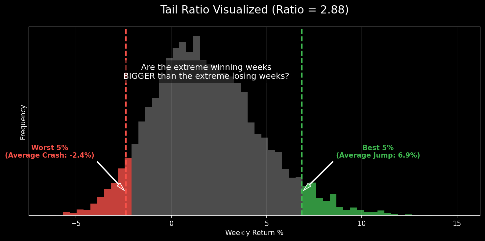

**How it works:**
1. It takes your worst 5% of weeks (The Red Zone) and finds the average loss. (e.g., -5%).
2. It takes your best 5% of weeks (The Green Zone) and finds the average gain. (e.g., +10%).
3. It divides the Green by the Red (`10 / 5 = 2.0`).

**How to read it:**
- **> 1.0 (Positive Asymmetry):** The stock's massive upside explosions are significantly larger than its massive crashes. (A great sign for volatile tech stocks).
- **< 1.0 (Negative Asymmetry):** The crashes are much deeper than the rallies. The stock "takes the stairs up, but takes the elevator down."

---

## 6. S&P 500 Benchmarking Grid

**The fundamental question:** Is this stock worth holding vs. just buying an index fund (SPY)?

---

### 6.1 Beta (vs SPY)

**Simple explanation — The Market Amplifier:**
Beta measures how much the stock amplifies or dampens market moves. If the S&P 500 drops 1%, how much does this stock drop?

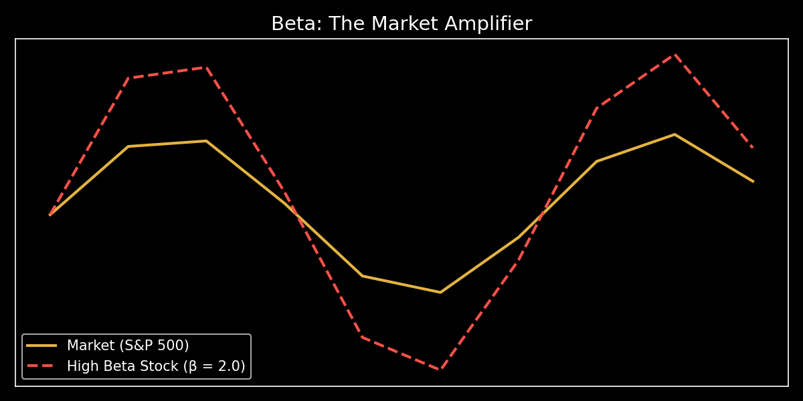

**Beta color coding:**
- **Beta > 1.2 (🔴 Red):** High market risk. The stock is a massive amplifier. In a crash, expect outsized, painful losses.
- **Beta 0.8–1.2 (🟢 Green):** Market-proportional. The stock moves relatively in sync with the broader market.
- **Beta < 0.8 (🟡 Yellow):** Defensive. A "shield" stock. It won't crash hard, but it will lag behind in huge bull markets.

**RSU Implication:** If your company's Beta is 3.0, a 10% market crash means a 30% crash in your RSU value. With a 4-year vesting cliff, one bad market cycle can wipe out years of expected compensation.

---

### 6.2 Annual Alpha (Jensen's Alpha)

**Simple explanation — The Skill Bonus:**
Alpha answers a very specific question: *"How much did this stock earn BEYOND what its risk level deserved?"*

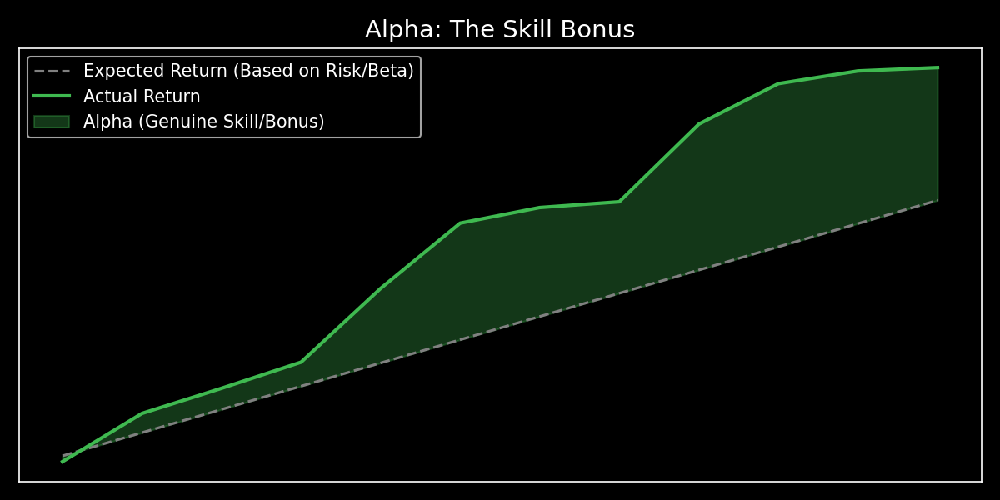

If you hold a highly volatile tech stock (Beta = 2.0), and the market goes up 20%, you logically *expect* your stock to go up 40%. 
If your stock actually goes up **47%**, that extra **+7%** is the **Alpha**. It is the genuine "bonus" return that came from the company actually doing great things (new products, great earnings), not just riding the coattails of a rising market.

---

### 6.3 R-Squared (R²)

**Simple explanation — The Puppet Strings:**
What percentage of this stock's weekly price moves are purely controlled by the S&P 500? Is it just a puppet dancing to the market's strings, or does it have a mind of its own?

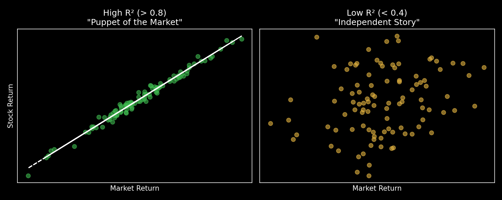

| R² | Meaning | RSU implication |
|----|---------|-----------------|
| **> 0.8** | The Puppet | Highly market-driven. Your RSUs act like a leveraged index fund. |
| **0.4–0.8** | Mixed Drivers | Both macro-economics and company earnings matter. |
| **< 0.4** | Independent | Company-specific news (earnings, products, scandals) completely dominates the price. |

---

### 6.4 Treynor Ratio

**Simple explanation — Forgiving Company Volatility:**
The Sharpe Ratio punishes a stock for *all* bounciness. But if you hold a highly diversified portfolio, the random company-specific bounciness cancels itself out. The only risk left is "Market Risk" (Beta). 

The **Treynor Ratio** only punishes a stock for its Beta risk.

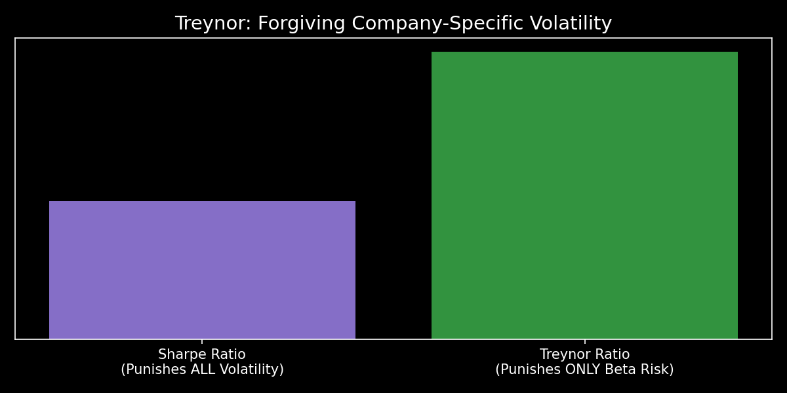

If a stock is incredibly bouncy but has a low Beta (meaning it doesn't crash when the market crashes), Treynor will rate it extremely highly, while Sharpe would unfairly penalize it.

---

### 6.5 Upside / Downside Capture Ratios

**Simple explanation — The Fair-Weather Friend vs The Shield:**
How does this stock act when the overall market is having a great week vs a terrible week?
- **Upside Capture = 150%** → When the S&P 500 goes UP 1%, this stock zooms up 1.5%. (Great!)
- **Downside Capture = 60%** → When the S&P 500 goes DOWN 1%, this stock only falls 0.6%. (A perfect shield!)

When evaluating an RSU or a stock, you want to map it into one of four quadrants:

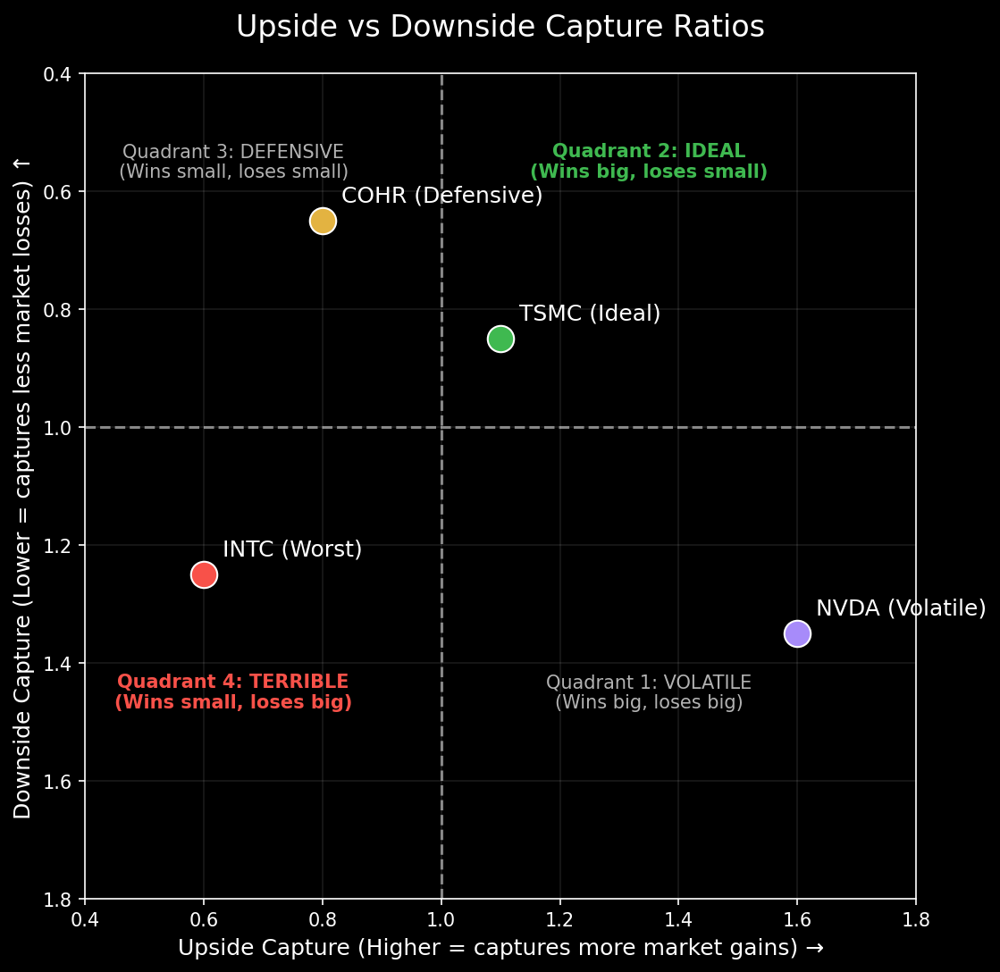

**The 4 Quadrants of Stocks:**
1. **IDEAL (High Up / Low Down):** The holy grail. It captures massive gains during bull markets, but shields you from losses during crashes. 
2. **DEFENSIVE (Low Up / Low Down):** Safe and boring. Won't make you rich in a bull market, but protects your money in a crash.
3. **VOLATILE (High Up / High Down):** A wild ride. Great in bull markets, but will obliterate your portfolio in a crash. (Many semi-cap tech stocks live here).
4. **TERRIBLE (Low Up / High Down):** The absolute worst. It misses out on market gains, but still crashes harder than the market. Sell immediately.

---

### 6.6 Information Ratio (IR)

**Simple explanation — The Consistency Champion:**
Alpha tells you *if* a stock beat the market. The Information Ratio (IR) tells you *how consistently* it did it.

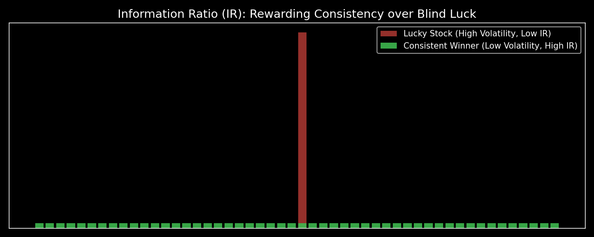

A stock could beat the market by 20% in one massive, lucky week, and then do absolutely nothing for the rest of the year. It will have a great Alpha, but a terrible Information Ratio. IR rewards the slow, steady grinder that consistently beats the market week after week.

---

### 6.7 Tracking Error & Correlation

**Simple explanation — Wandering off the path:**

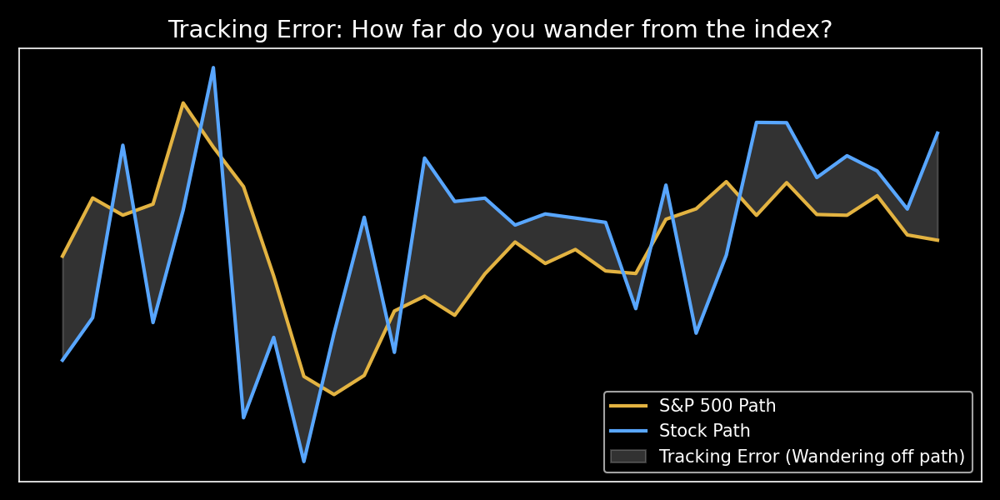

- **Tracking Error:** Measures exactly how far the stock wanders away from the S&P 500 path. A high tracking error means the stock is doing its own wild thing (high idiosyncratic risk).
- **Correlation to SPY:** A simple number from -1 to +1. A +1 means it perfectly mimics the market. A -1 means it does the exact opposite of the market.

---

## 7. Quant & Trading Grid

---

### 7.1 Quant Score (0–100)

The terminal's **proprietary composite signal** — a single number summarizing all quantitative inputs for quick screening.


This score starts at 50 (neutral) and adds/subtracts points based on all the factors we discussed earlier:
- **Positives (+):** MACD Bullish momentum, Oversold RSI, High Alpha, Great Sortino Ratio.
- **Negatives (-):** Overbought RSI, Extreme Greed, Negative Alpha.

The final score acts as your ultimate cheat sheet for buying or selling.

---

### 7.2 Sharpe Ratio

**Simple explanation — Is the juice worth the squeeze?**

Imagine two stocks, A and B. Both made a 20% return last year.
- **Stock A** went up a smooth, steady amount every single week. No stress, you slept great.
- **Stock B** surged up 50%, crashed down 40%, and then barely crawled back up to finish at 20%. You had three panic attacks.

If you only look at the final "Return", they look exactly the same (20%). But Stock A is vastly superior because it gave you the same money for way less "Risk" (stress/bounciness).

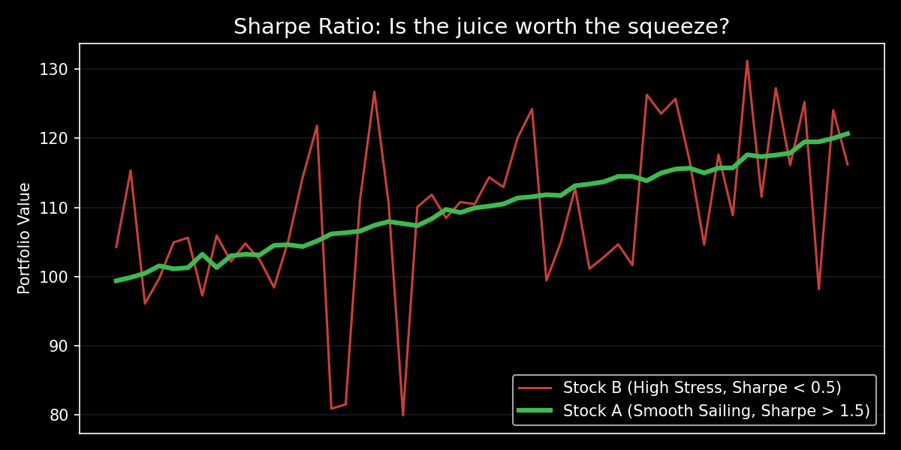

The **Sharpe Ratio** (invented by Nobel laureate William Sharpe) measures exactly this. It takes the extra money you made (above what a safe, boring bank savings account would pay) and divides it by the "bounciness" (volatility) of the stock. 

It answers the ultimate question: *Am I actually being compensated for all these heart attacks?*

**How to read it:**
- **< 0.5 (🔴 Bad):** You are taking on way too much stress for the tiny amount of money you're making.
- **0.5 – 1.0 (⚪ Average):** Normal market behavior.
- **> 1.0 (🟢 Excellent):** You are being heavily rewarded for the risk you're taking. (The "juice" is definitely worth the "squeeze"!)

---

### 7.3 Annual Volatility

**Simple explanation — The Rollercoaster Rating:**
Volatility measures how violently a stock swings up and down over a year. 

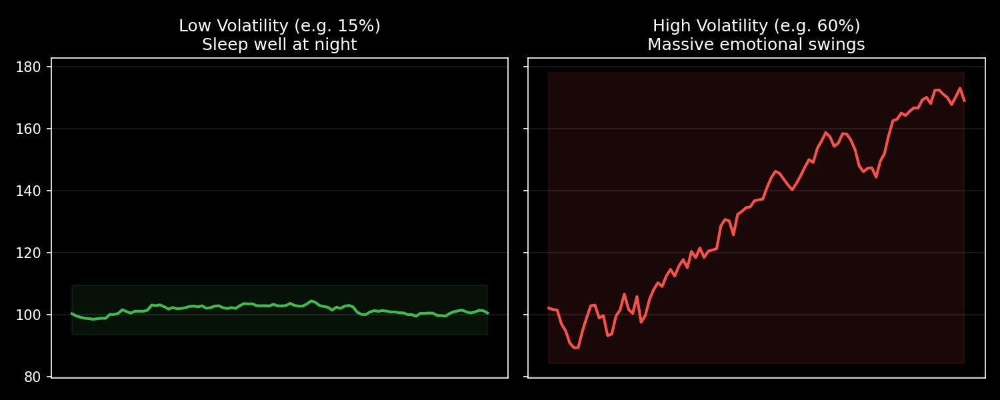

- **Low Volatility (15%):** Safe, slow, boring. Great for retirement accounts.
- **High Volatility (60%):** Wild, massive swings. You might double your money, or you might lose half of it in a month. (Common in crypto and biotech).

---

### 7.4 Fibonacci Support Level (61.8%)

**Simple explanation — The Golden Bounce:**
When a stock goes on a massive run upward, it almost never goes up in a straight line. Eventually, buyers take profit and the stock "pulls back" (drops temporarily).

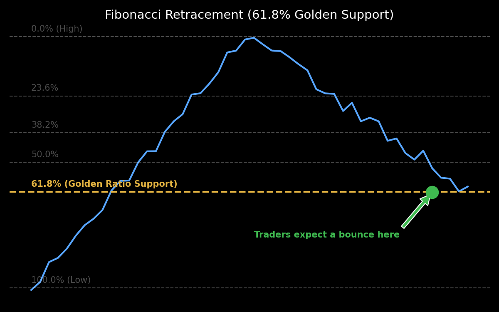

Traders use the Fibonacci "Golden Ratio" (61.8%) to predict exactly where that drop will stop and bounce back up. If a stock drops past the 61.8% line, the upward trend is likely dead. If it bounces off the line, the rally continues!

---

### 7.5 Monte Carlo Scenarios (6-Month Projections)

**Simple explanation — Doctor Strange's 2,000 Futures:**
Instead of guessing where a stock will be in 6 months, a Monte Carlo simulation uses advanced math (Merton Jump-Diffusion) to simulate 2,000 different possible futures, factoring in the stock's normal volatility and its history of random crashes.

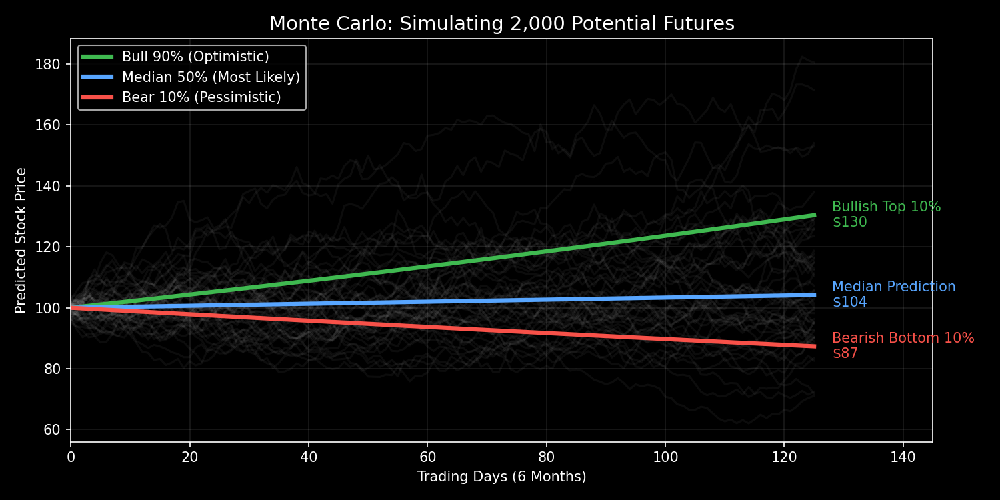

It then looks at all 2,000 futures and gives you three numbers:
- **MC Bull 90%:** The optimistic scenario (only 10% of futures were better than this).
- **MC Median:** The most likely outcome right in the middle of the pack.
- **MC Bear 10%:** The pessimistic crash scenario (only 10% of futures were worse than this).

---

## 8. Detail Modal — 9 Charts

Clicking any stock card opens the full-screen detail modal with 9 professional charts.

---

### Chart 1: Price Action + SMA40 + Bollinger Bands

See Section 2. Master reference showing 52 weeks of price history, long-term trend (SMA40), and statistical volatility envelope (Bollinger Bands).

---

### Chart 2: Underwater Drawdown

**What it shows:** Red area chart. Sits at 0% when stock is at or above its prior peak, dips negative when underwater.


---

### Chart 3: Weekly Returns Distribution (Histogram + Normal Overlay)

**What it shows:** Histogram of all weekly returns, with theoretical normal curve overlaid.


---

### Chart 4: 26-Week Rolling Volatility (Annualized)


---

### Chart 5: 26-Week Rolling Beta (vs SPY)

Beta is NOT constant. During crashes, Beta can spike as stocks become highly correlated with market risk.

---

### Chart 6: 26-Week Rolling Sharpe Ratio

This chart reveals *when* a stock was a good risk-adjusted investment vs. when it wasn't.

---

### Chart 7: Merton Jump-Diffusion Monte Carlo (15 sample paths)

For full math see Section 12. Displays 15 possible future price paths based on historical volatility and jump risks.

---

### Chart 8: 26-Week Rolling Correlation vs S&P 500

"Correlations go to 1 in a crisis". During market crashes, diversification disappears. This chart lets you SEE this happening.

---

### Chart 9: VaR Stress Test Bar Chart

Five different risk measurement methodologies shown side-by-side for the same stock, highlighting the fat tail risks.

---

## 9. Extended Metrics Grid

25 metrics in a 5×5 grid at the bottom of the detail modal.

---

### 9.1 Calmar Ratio

```
Calmar = Annualized Return / |Max Drawdown|
```

Measures how efficiently the stock uses its worst-case pain budget.

---

### 9.2 ATR % (Average True Range, 14-Week)

```
ATR% = ATR / Current Price × 100
```

The typical weekly price swing as a percentage of current price. Useful for stop-loss placement and position sizing.

---

### 9.3 Price Z-Score

Where does the current price sit in its recent statistical distribution? High Z-score implies statistically expensive.

---

### 9.4 Win Rate & 9.5 Half-Kelly Position Size

```
Kelly Fraction K = p − (1-p)/R
  where: p = Win Rate, R = Average Win / Average Loss

Half-Kelly = K / 2  ← recommended position size as % of portfolio
```

---

### 9.6 Gain-to-Pain Ratio

```
G2P = Σ(positive returns) / Σ(|negative returns|)
```

Simple cumulative ratio of gains to losses.

---

### 9.7 Pain Index & 9.9 Serenity Ratio

```
Pain Index = (1/n) × Σ|DD[t]| × 100    (average of absolute drawdowns)
```

Pain Index is MORE sensitive to DURATION than Ulcer Index.

```
Serenity Ratio = (Annualized Return − Risk-Free Rate) / Pain Index
```

---

### 9.8 Recovery Factor

```
Recovery Factor = |Total Return (%)| / |Max Drawdown (%)|
```

Did the cumulative gains justify the worst episode of pain?

---

### 9.10 Fama-French 12-1 Momentum Factor

Return from 12 months ago to 1 month ago, **skipping the most recent 4 weeks** to avoid short-term reversal noise.

---

### 9.11 Volatility Regime (EWMA/Historical)

Compares exponential moving average volatility (responsive) with long-term historical volatility to detect current risk spikes.

---

### 9.12 Max Drawdown Duration

```
DD Duration = Maximum consecutive weeks spent below prior peak
```

Why duration matters MORE than depth for RSU holders: You don't want to vest underwater for years.

---

### 9.13 Historical VaR at 90%, 95%, 99%

Uses the actual observed returns to determine value at risk, highlighting non-normal fat tails.

---

## 10. Universe Risk Map

A bubble scatter plot for portfolio-level comparison of all stocks simultaneously based on Annual Volatility (Risk %) vs 1-Year Return (%).

---

## 11. Universe Correlation Heatmap

A symmetric matrix where every cell shows the Pearson correlation of weekly returns between stocks. Deep blue = perfect co-movement. White = independent.

---

## 12. The Monte Carlo Engine

### The Merton Jump-Diffusion Model

Adds **random jumps** to the standard Black-Scholes model to better represent sudden price shocks (like earnings misses).

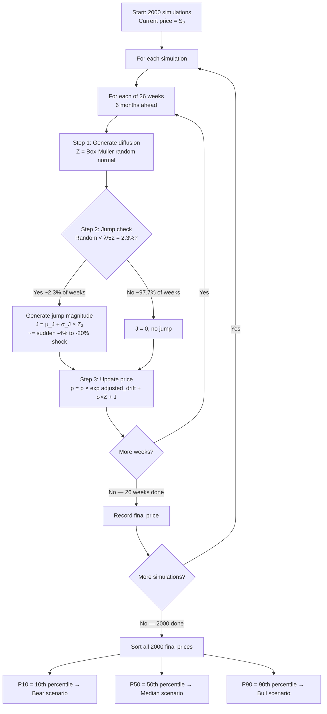
```mermaid
flowchart TD
    A[Start: 2000 simulations\nCurrent price = S₀] --> B[For each simulation]
    B --> C[For each of 26 weeks\n6 months ahead]
    C --> D[Step 1: Generate diffusion\nZ = Box-Muller random normal]
    D --> E{Step 2: Jump check\nRandom < λ/52 = 2.3%?}
    E -->|Yes ~2.3% of weeks| F[Generate jump magnitude\nJ = μ_J + σ_J × Z₂\n~= sudden -4% to -20% shock]
    E -->|No ~97.7% of weeks| G[J = 0, no jump]
    F --> H[Step 3: Update price\np = p × exp adjusted_drift + σ×Z + J]
    G --> H
    H --> I{More weeks?}
    I -->|Yes| C
    I -->|No — 26 weeks done| J[Record final price]
    J --> K{More simulations?}
    K -->|Yes| B
    K -->|No — 2000 done| L[Sort all 2000 final prices]
    L --> M[P10 = 10th percentile → Bear scenario]
    L --> N[P50 = 50th percentile → Median scenario]
    L --> O[P90 = 90th percentile → Bull scenario]
```

---

## 13. Appendix — Statistical Foundations

Detailed statistical breakdowns:
- Standard Deviation
- Normal Distribution and why finance breaks it
- Covariance, Correlation, and Beta
- Square Root of Time Rule
- EWMA (Exponential Weighted Moving Average)
- Variance Drag

---

## 14. Quick-Reference Cheat Sheet

| Metric | 🟢 Green (Good) | 🟡 Yellow (Caution) | 🔴 Red (Bad) | Key Question |
|--------|----------------|--------------------|-----------|----|
| **Max Drawdown** | > −20% | −20% to −40% | < −50% | Worst-case loss from peak? |
| **VaR 95% (Wk)** | > −5% | −5% to −10% | < −15% | Worst 5% of weeks? |
| **Sortino** | > 1.5 | 0.5–1.5 | < 0.5 | Return per downside risk? |
| **Sharpe** | > 1.0 | 0.5–1.0 | < 0.5 | Return per total risk? |
| **Beta** | 0.8–1.5 | 1.5–2.5 | > 3.0 | Market amplification? |
| **Alpha** | > +5% | −2% to +5% | < −5% | True outperformance? |
| **Omega** | > 1.5 | 1.0–1.5 | < 1.0 | Gains vs losses ledger? |

---

## RSU Decision Framework — Putting It All Together

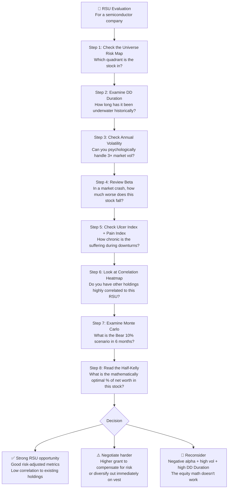
```mermaid
flowchart TD
    A[🎯 RSU Evaluation\nFor a semiconductor company] --> B[Step 1: Check the Universe Risk Map\nWhich quadrant is the stock in?]
    B --> C[Step 2: Examine DD Duration\nHow long has it been underwater historically?]
    C --> D[Step 3: Check Annual Volatility\nCan you psychologically handle 3× market vol?]
    D --> E[Step 4: Review Beta\nIn a market crash, how much worse does this stock fall?]
    E --> F[Step 5: Check Ulcer Index + Pain Index\nHow chronic is the suffering during downturns?]
    F --> G[Step 6: Look at Correlation Heatmap\nDo you have other holdings highly correlated to this RSU?]
    G --> H[Step 7: Examine Monte Carlo\nWhat is the Bear 10% scenario in 6 months?]
    H --> I[Step 8: Read the Half-Kelly\nWhat is the mathematically optimal % of net worth in this stock?]
    I --> J{Decision}
    J --> K[✅ Strong RSU opportunity\nGood risk-adjusted metrics\nLow correlation to existing holdings]
    J --> L[⚠️ Negotiate harder\nHigher grant to compensate for risk\nor diversify out immediately on vest]
    J --> M[🔴 Reconsider\nNegative alpha + high vol + high DD Duration\nThe equity math doesn't work]
```

---

*Documentation for Career Semi Quant Terminal — Semiconductor Analytics Platform*

*All calculations use 18+ months of weekly closing prices. Risk-free rate: 4.5% (US 10-year Treasury proxy). Benchmark: S&P 500 ETF (SPY). All figures are backward-looking historical statistics — not forward projections or investment advice.*
