# Career Semi Quant Terminal — Complete Documentation

> **Who is this for?** Everyone — from someone who has never bought a stock, to a software engineer evaluating RSU packages, to an experienced quant researcher. Every metric is explained from first principles with simple analogies, precise mathematics, real stock plots, and semiconductor examples.

---

## Table of Contents

1. [Introduction — Why Quant Analytics?](#1-introduction)
2. [The Main Price Chart — SMA & Bollinger Bands](#2-main-price-chart)
3. [Fear & Greed Gauge](#3-fear--greed-gauge)
4. [Risk Metrics Grid](#4-risk-metrics-grid)
5. [Advanced Quant Analytics](#5-advanced-quant-analytics)
6. [S&P 500 Benchmarking Grid](#6-sp-500-benchmarking-grid)
7. [Quant & Trading Grid](#7-quant--trading-grid)
8. [Detail Modal — 9 Charts Explained](#8-detail-modal--9-charts)
9. [Extended Metrics Grid (25 metrics)](#9-extended-metrics-grid)
10. [Universe Risk Map](#10-universe-risk-map)
11. [Universe Correlation Heatmap](#11-universe-correlation-heatmap)
12. [The Monte Carlo Engine (Merton Jump-Diffusion)](#12-the-monte-carlo-engine)
13. [Statistical Foundations Appendix](#13-appendix--statistical-foundations)
14. [Quick-Reference Cheat Sheet](#14-quick-reference-cheat-sheet)

---

## 1. Introduction

### Why does quantitative analysis matter?

Imagine you are choosing between two job offers. Both offer RSUs. Company A's stock went up **200%** last year. Company B's stock went up **80%**. Which is better?

If you said Company A — you might be wrong. A stock with an incredibly high peak might have crashed right after, while a stock with steady growth provides real, reliable value. Quantitative analysis reveals the full picture that raw return numbers hide.

### How the terminal works

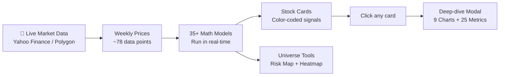

### Why Weekly Prices?

- **Daily prices** → Too noisy (market noise, HFT). Jagged and hard to read trends.
- **Weekly prices** → Clean signal, 52–78 data points per 1.5 years ✅. Clear trends visible.
- **Monthly prices** → Too few data points (only ~18). Not enough for robust statistics.

---

## 2. Main Price Chart

### What you see

The large chart in every stock's detail modal shows three things:

- 🔵 **Blue line** — actual weekly closing price
- 🟡 **Gold dashed line** — 40-Week Simple Moving Average (SMA40)
- ⬜ **Faint white band** — Bollinger Bands (20-week, ±2 standard deviations)

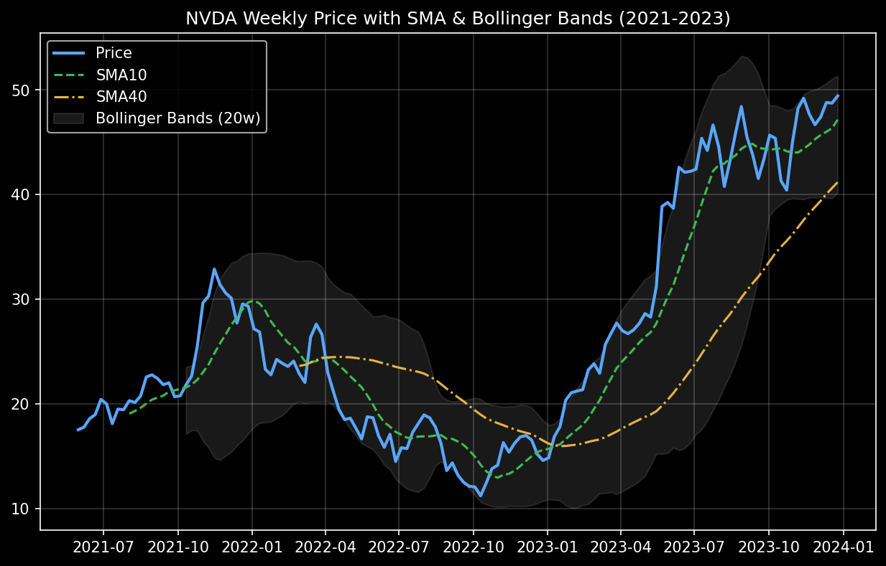

---

### 2.1 Simple Moving Average (SMA)

**Simple explanation — The smoothing iron:**
Imagine you're tracking your daily step count. Instead of looking at each day's jagged numbers, you average the last 10 days. The bumps smooth out, and you can see the real trend. That's a moving average.

**Mathematical definition:**

```
SMA(n) at time t = (P[t] + P[t-1] + ... + P[t-n+1]) / n
```

Where `P[t]` is the closing price at week `t`, and `n` is the window size.

**The two SMAs and their roles:**

| SMA | Window | Speed | Purpose |
|-----|--------|-------|---------|
| SMA10 | 10 weeks | Fast — reacts quickly | Short-term trend direction |
| SMA40 | 40 weeks | Slow — smooths noise | Long-term trend / support level |

**Bull/Bear Cross Signal — how it works:**

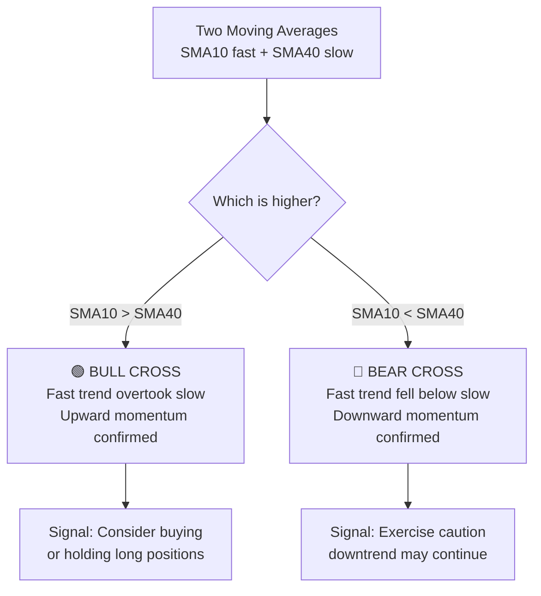

> [!TIP]
> The Bull Cross in February 2023 for NVDA (shown in the chart above) preceded a massive run. The signal doesn't predict *how far* — it confirms the trend has shifted direction.

---

### 2.2 Bollinger Bands

**Simple explanation — The mood ring:**
If someone's test scores average 75, and they almost never score below 60 or above 90, then a score of 95 today is *statistically unusual* — it'll probably drift back. Bollinger Bands apply this reasoning to stock prices.

**Mathematical definition:**

```
Middle Band  = SMA(20)
Upper Band   = SMA(20) + 2 × σ(20)     ← 2 standard deviations above
Lower Band   = SMA(20) − 2 × σ(20)     ← 2 standard deviations below
```

Where `σ(20)` = standard deviation of the last 20 weekly closes.

**Reading guide:**

| Price Location | What it means | Action signal |
|---------------|---------------|---------------|
| Touches upper band | Statistically expensive | Watch for reversal OR riding a strong trend |
| Touches lower band | Statistically cheap | Watch for bounce / contrarian buy |
| Bands expanding | Volatility increasing | Uncertainty rising — big moves ahead |
| **Bands squeezing** | **Volatility compressing** | **⚡ Large move imminent — direction unknown** |
| Price rides upper band for weeks | Very strong uptrend | Don't sell just because it looks "expensive" |

---

### 2.3 MACD (Moving Average Convergence Divergence)

**Simple explanation — The speedometer:**
MACD doesn't measure *speed* — it measures *acceleration*. Is the stock gaining momentum or losing it? A car going 60 mph but slowing down will stop. A car at 30 mph but accelerating will eventually overtake.

**Mathematical definition:**

```
EMA(n, t) = Price[t] × k + EMA[t-1] × (1-k)   where k = 2/(n+1)

MACD Line    = EMA(12) − EMA(26)     ← short-term minus long-term speed
Signal Line  = EMA(9) of MACD Line   ← smoothed version of MACD
Histogram    = MACD Line − Signal Line
```

- **Histogram > 0** → Short-term EMA overtaking long-term → **Bullish momentum** 🟢
- **Histogram < 0** → Short-term falling behind → **Bearish momentum** 🔴

---

## 3. Fear & Greed Gauge

### Simple explanation — The crowd at an auction

Think of the stock market as an auction where crowd emotion drives bids. When everyone is terrified (FEAR), they dump assets at any price — historically great buying opportunities. When everyone is euphoric (GREED), they overbid for everything — dangerous for new buyers.

### The Formula

```
FearGreed = (RSI + Stochastic + VolScore) / 3

VolScore = clamp(100 − (AnnualVol% − 15) × 1.5, 0, 100)
```

**How each component contributes:**

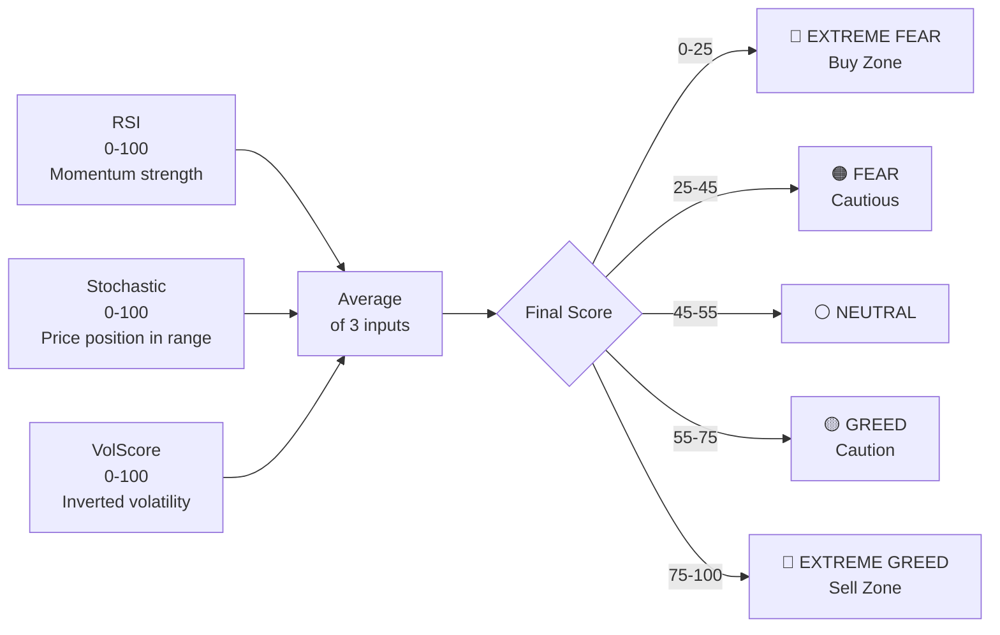

**Step-by-step worked example — NVDA at trough:**

```
Input data (October 2022):
  RSI           = 28   (oversold — stock fell too hard, too fast)
  Stochastic    = 15   (price at bottom of 14-week range)
  Annual Vol    = 78%  → VolScore = 100 − (78−15)×1.5 = 100 − 94.5 = 5.5

Calculation:
  FearGreed = (28 + 15 + 5.5) / 3 = 48.5 / 3 = 16.2

Result: 16.2 → EXTREME FEAR 🔴 ← Perfect contrarian buy signal!
```

---

## 4. Risk Metrics Grid

These answer the fundamental question: **what can go wrong, and how bad?**

---

### 4.1 Max Drawdown (MaxDD)

**Simple explanation — The worst-case investor:**
"If I had the absolute worst timing — buying exactly at the peak and selling exactly at the bottom — how much money would I have lost?" That is Max Drawdown.

**Mathematical definition:**

```
MaxDD = min over all time t of:
        (P[t] − max(P[0..t])) / max(P[0..t]) × 100
```

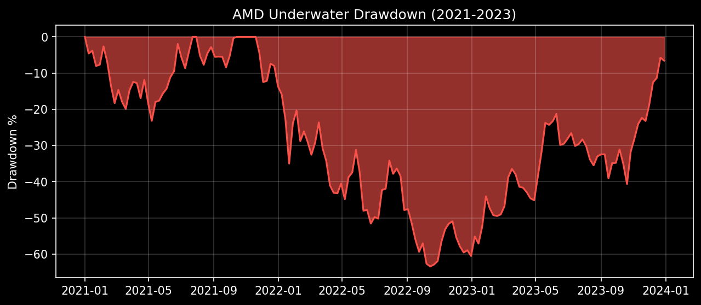

An employee who received AMD RSUs in Nov 2021 watched their equity lose 68% of its value by Oct 2022. That's a 4-year vesting cliff that started deeply underwater.

> [!IMPORTANT]
> MaxDD answers: "How deep was the worst hole?" — but it doesn't answer "How long did I sit in that hole?" For that, see **Ulcer Index** (Section 5.6) and **DD Duration** (Section 9.12).

---

### 4.2 Value at Risk — VaR 95% (Weekly Parametric)

**Simple explanation — The weather forecast for losses:**
A weather forecast says "90% chance of less than 1 inch of rain." VaR says "95% chance your weekly loss will be smaller than X%." In the *worst 5% of weeks*, you lose at least X%.

**Mathematical definition (Parametric / Gaussian VaR):**

```
VaR 95% = −(μ_weekly − 1.645 × σ_weekly) × 100
```

Where:
- `μ_weekly` = mean of all weekly returns
- `σ_weekly` = standard deviation of all weekly returns
- `1.645` = the 5th percentile z-score of the standard normal distribution

> [!WARNING]
> Parametric VaR assumes a normal (bell curve) distribution. Real returns have **fat tails** — crashes happen more often and are worse than the bell curve predicts. Always check CF mVaR (Section 5.1) alongside this number.

---

### 4.3 Sortino Ratio

**Simple explanation — The fair risk penalty:**
The standard Sharpe Ratio penalizes you equally for going up 30% (great!) and down 30% (terrible!). That's unfair — investors don't mind upside surprises. The Sortino Ratio fixes this by only penalizing **downside** volatility.

**Mathematical definition:**

```
Sortino Ratio = (Annualized Return − Risk-Free Rate) / Downside Deviation

Downside Deviation = sqrt( Σ(r²) for ALL negative weeks / total weeks ) × sqrt(52)
```

Note: We include only **negative** weekly returns in the squared sum, but divide by the **total** number of weeks (penalizes both frequency and magnitude of losses).

---

### 4.4 RSI (Relative Strength Index) — shown in tech bar

**Simple explanation — The tired runner:**
A sprinter running at full speed for 10 minutes can't sustain it — they'll slow down. RSI applies "fatigue" to stock prices. A stock that has surged every week for months is "tired" and statistically likely to slow or reverse.

**Mathematical definition:**

```
RSI = 100 − 100 / (1 + RS)

RS = Average Up-Week Gain / Average Down-Week Loss  (over last 14 weeks)
```

**RSI quick reference:**

| RSI | Signal | Meaning | Trading implication |
|-----|--------|---------|---------------------|
| < 30 | 🟢 Oversold | Stock fell too fast | Contrarian: watch for bounce |
| 30–45 | Mild oversold | Possible opportunity | Monitor closely |
| 45–55 | Neutral | No strong signal | Hold existing positions |
| 55–75 | Bullish | Uptrend in progress | Ride the trend |
| > 75 | 🔴 Overbought | Stock rose too fast | Take profits / caution |

---

### 4.5 Stochastic Oscillator — shown in tech bar

**Simple explanation — Where in the room are you?**
If ceiling height is 10 ft and floor is 0 ft, and you're at 8.5 ft — you're at 85% of the range. Stochastic asks: "Where is today's price inside its recent high/low range?"

**Mathematical definition:**

```
Stochastic = (Close − Lowest Low[14wk]) / (Highest High[14wk] − Lowest Low[14wk]) × 100
```

---

## 5. Advanced Quant Analytics

These appear in the lower section of the risk grid — color-coded purple/cyan to distinguish from basic metrics.

---

### 5.1 Cornish-Fisher Modified VaR (CF mVaR 95%)

**The problem with standard VaR:** The z-score of 1.645 assumes a perfect bell curve. Real stock returns are NOT bell-curved. They have fat tails.

**The Cornish-Fisher expansion (1938):**
Adjusts the z-score based on the actual shape of the distribution:

```
z_CF = z + (1/6)(z²-1)×S + (1/24)(z³-3z)×K − (1/36)(2z³-5z)×S²

CF mVaR = −(μ + z_CF × σ)
```

Where:
- `z = −1.645` (standard 5% z-score)
- `S` = skewness of the return distribution
- `K` = excess kurtosis (kurtosis − 3)

> [!IMPORTANT]
> When the JB test score is high, standard VaR is dangerously misleading. CF mVaR is the honest single-number risk estimate.

---

### 5.2 Jarque-Bera Test (JB Statistic)

**Simple explanation — The normality smoke alarm:**
JB is a formal statistical test. Its null hypothesis: "This distribution is normal." High JB score = alarm triggered = distribution has significant skewness/kurtosis = standard risk models are unreliable.

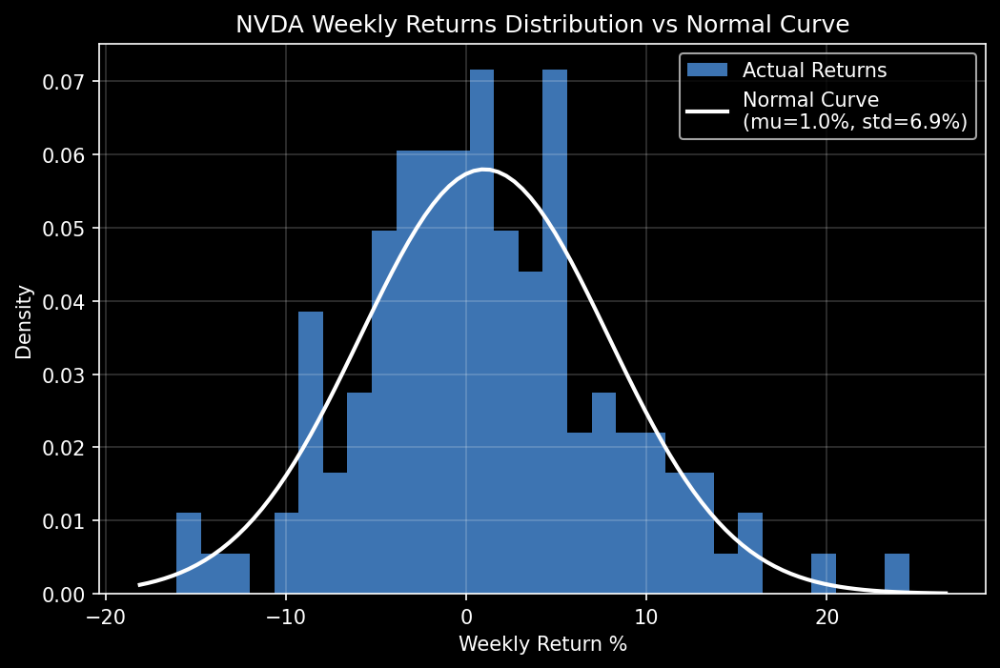

Notice how the actual returns histogram deviates from the smooth normal curve, often showing fat tails and skewness.

**JB interpretation with real examples:**

| JB Value | Assessment | Real example |
|----------|-----------|--------------|
| < 5 | Nearly normal. Standard risk models reliable. | COHR: JB ≈ 2.5 |
| 5–20 | Mild non-normality. Use CF mVaR alongside VaR. | TSMC: JB ≈ 9.1 |
| 20–100 | Significant non-normality. CF mVaR and CVaR essential. | MTSI: JB ≈ 56.4 |
| > 100 | Extreme non-normality. Standard VaR dangerously wrong. | MXL: JB ≈ 145 |

---

### 5.3 Omega Ratio

**Simple explanation — The totals ledger:**
At year end: add every dollar gained in up-weeks. Add every dollar lost in down-weeks. Divide gains by losses. Omega makes **zero distributional assumptions** — it just counts actual money.

**Mathematical definition:**

```
Ω(τ) = Σ(r_i − τ) for r_i > τ
        ÷
        Σ(τ − r_i) for r_i < τ

We use τ = 0 (threshold = "beating doing nothing")
```

---

### 5.4 Hurst Exponent

**Simple explanation — Does the stock trend or bounce?**
Flip a fair coin: Heads = up, Tails = down. Each flip is independent — no pattern, no prediction. That's a perfect random walk. Real stocks are *not always* random:

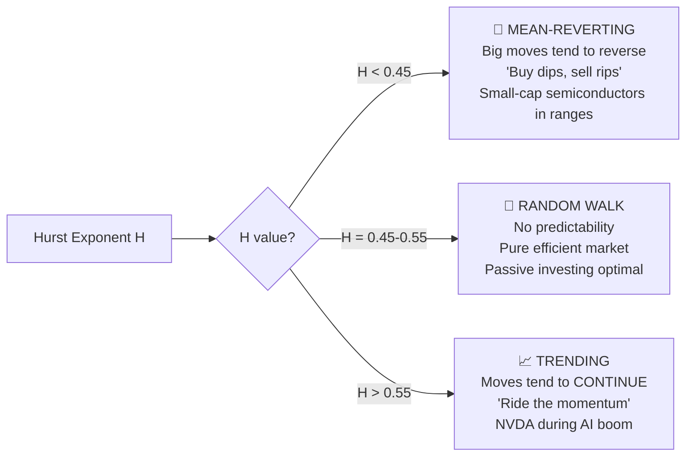

---

### 5.5 Autocorrelation (Lag-1)

**Simple explanation — Does history repeat next week?**
If last week was +8%, does that predict this week's direction? Autocorrelation at lag-1 measures this exact linear relationship.

**Mathematical definition:**

```
ρ₁ = Σ[(r[t] − μ)(r[t-1] − μ)] / Σ[(r[t-1] − μ)²]  for t = 2 to n
```

This is the Pearson correlation between the return series and itself shifted by one week.

---

### 5.6 Ulcer Index

**Simple explanation — The chronic pain meter:**
Max Drawdown tells you *how deep* the worst hole was. Ulcer Index tells you *how long* you suffered. A stock that crashes 20% and recovers in 2 weeks: brief pain. A stock that falls 20% and stays there for 6 months: chronic suffering. Peter Martin (1987) named it perfectly — prolonged drawdowns give investors stomach ulcers.

**Mathematical definition:**

```
Ulcer Index = sqrt( Σ(D[t]²) / n ) × 100

where D[t] = (P[t] − Peak[t]) / Peak[t]  (drawdown fraction at time t)
```

---

### 5.7 Tail Ratio

**Simple explanation — Is the upside bigger than the downside?**
In the BEST 5% of weeks, how much does this stock gain? In the WORST 5% of weeks, how much does it lose? Tail Ratio = best tail / worst tail.

**Mathematical definition:**

```
Tail Ratio = |P₉₅| / |P₅|

P₉₅ = 95th percentile of returns (best 5% of weeks)
P₅  = 5th percentile of returns  (worst 5% of weeks)
```

---

## 6. S&P 500 Benchmarking Grid

**The fundamental question:** Is this stock worth holding vs. just buying an index fund (SPY)?

---

### 6.1 Beta (vs SPY)

**Simple explanation — The market amplifier:**
Beta measures how much the stock amplifies or dampens market moves. If the S&P 500 drops 1%, how much does this stock drop?

**Mathematical definition:**

```
β = Cov(r_stock, r_market) / Var(r_market)
  = ρ × (σ_stock / σ_market)
```

**Beta color coding:**
- Beta > 1.2 → 🔴 Red (high systematic risk — in a crash, expect outsized losses)
- Beta 0.8–1.2 → 🟢 Green (market-proportional)
- Beta < 0.8 → 🟡 Yellow (defensive; may underperform in bull markets)

**RSU implication:** Beta = 3.0 means a 10% market crash → ~30% RSU stock crash. With a 4-year vesting cliff, one bad market cycle can wipe out years of expected comp.

---

### 6.2 Annual Alpha (Jensen's Alpha)

**Simple explanation — The skill bonus:**
If you hired a portfolio manager investing in 2× leveraged stocks (Beta=2) and markets rose 20%, you'd *expect* their portfolio up ~40%. If it went up 47%, the extra +7% is their **Alpha** — genuine skill, not just market risk.

Alpha answers: *"How much did this stock earn BEYOND what its Beta-level risk deserved?"*

---

### 6.3 R-Squared (R²)

**Simple explanation — The market puppet string:**
What percentage of this stock's weekly price moves are explained by the S&P 500? How much is it just a leveraged market proxy vs. having its own story?

| R² | Meaning | RSU implication |
|----|---------|-----------------|
| > 0.8 | Highly market-driven | Essentially a leveraged index fund with extra vol |
| 0.4–0.8 | Mixed drivers | Both macro and company factors matter |
| < 0.4 | Company-specific dominant | Earnings, products, management drive price |
| < 0.1 | Nearly market-independent | Alpha calculation is statistically uncertain |

---

### 6.4 Treynor Ratio

**Simple explanation — Return per market risk unit:**
Sharpe penalizes ALL volatility. But if you hold this stock inside a diversified portfolio, company-specific volatility gets diversified away. Only **Beta risk** (market risk) remains. Treynor rewards efficient use of that undiversifiable risk.

**Mathematical definition:**

```
Treynor Ratio = (Annualized Return − Risk-Free Rate) / Beta
```

---

### 6.5 Upside / Downside Capture Ratios

**Simple explanation — Asymmetric participation:**
- **Upside Capture = 150%** → When S&P 500 goes UP, this stock captures 150% of that gain
- **Downside Capture = 60%** → When S&P 500 goes DOWN, this stock falls only 60% as much

```mermaid
quadrantChart
    title Upside vs Downside Capture Ratio
    x-axis Low Upside Capture --> High Upside Capture
    y-axis Low Downside Capture --> High Downside Capture
    quadrant-1 ⚡ VOLATILE: More of everything
    quadrant-2 ⭐ IDEAL: Win more, lose less
    quadrant-3 🛡️ DEFENSIVE: Conservative
    quadrant-4 🔴 WORST: Miss gains, amplify losses
    TSMC: [0.60, 0.35]
    COHR: [0.80, 0.27]
    NVDA: [0.72, 0.55]
    GFS: [0.35, 0.65]
```

---

### 6.6 Information Ratio (IR)

**Simple explanation — The consistency champion:**
Alpha says "did this stock beat the market?" IR says "how *consistently* did it beat the market?" You can be lucky once. IR penalizes inconsistency.

**Mathematical definition:**

```
IR = Mean(weekly excess return) / StdDev(weekly excess return) × sqrt(52)

where excess return = stock return − SPY return each week
```

---

### 6.7 Tracking Error & Correlation to SPY

**Tracking Error** = how far the stock wanders from the S&P 500 path. High tracking error implies high idiosyncratic risk.

**Correlation to SPY** = ρ = sign(β) × sqrt(R²), ranges from −1 to +1.

---

## 7. Quant & Trading Grid

---

### 7.1 Quant Score (0–100)

The terminal's **proprietary composite signal** — a single number summarizing all quantitative inputs for quick screening.

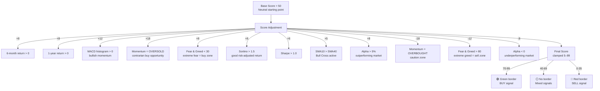

---

### 7.2 Sharpe Ratio

**Simple explanation — Return per unit of total risk:**
Sharpe normalizes returns by total volatility experienced.

**Mathematical definition (William Sharpe, Nobel Prize 1990):**

```
Sharpe = (Annualized Return − Risk-Free Rate) / Annualized Volatility
       = (R_p − R_f) / σ_p
```

---

### 7.3 Annual Volatility

The core risk measure — the typical annual swing range of returns.

```
Ann. Volatility = StdDev(weekly returns) × sqrt(52)
```

---

### 7.4 Fibonacci Support Level (61.8%)

Fibonacci levels come from the Golden Ratio. Traders believe price levels at these ratios act as natural support/resistance.

```
Fib 61.8% Level = High − (High − Low) × 0.618
```

---

### 7.5 Monte Carlo Scenarios (6-Month Projections)

**MC 6M Median:** Most likely 6-month price (50th percentile of 2,000 simulations)
**MC Bull 90%:** Optimistic scenario (90th percentile)
**MC Bear 10%:** Pessimistic scenario (10th percentile)

See Section 12 for the full Merton Jump-Diffusion mathematical explanation.

---

## 8. Detail Modal — 9 Charts

Clicking any stock card opens the full-screen detail modal with 9 professional charts.

---

### Chart 1: Price Action + SMA40 + Bollinger Bands

See Section 2. Master reference showing 52 weeks of price history, long-term trend (SMA40), and statistical volatility envelope (Bollinger Bands).

---

### Chart 2: Underwater Drawdown

**What it shows:** Red area chart. Sits at 0% when stock is at or above its prior peak, dips negative when underwater.


---

### Chart 3: Weekly Returns Distribution (Histogram + Normal Overlay)

**What it shows:** Histogram of all weekly returns, with theoretical normal curve overlaid.


---

### Chart 4: 26-Week Rolling Volatility (Annualized)

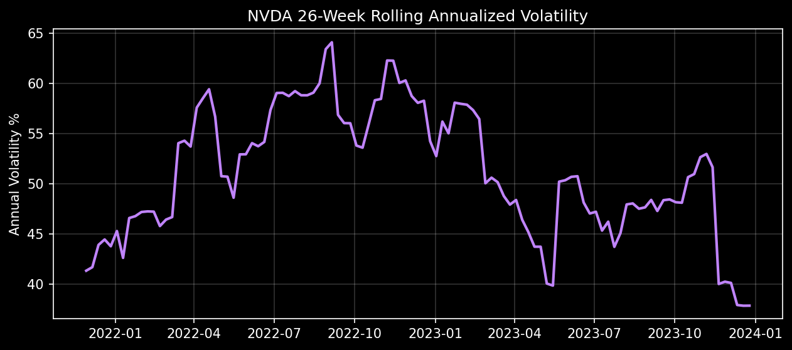

---

### Chart 5: 26-Week Rolling Beta (vs SPY)

Beta is NOT constant. During crashes, Beta can spike as stocks become highly correlated with market risk.

---

### Chart 6: 26-Week Rolling Sharpe Ratio

This chart reveals *when* a stock was a good risk-adjusted investment vs. when it wasn't.

---

### Chart 7: Merton Jump-Diffusion Monte Carlo (15 sample paths)

For full math see Section 12. Displays 15 possible future price paths based on historical volatility and jump risks.

---

### Chart 8: 26-Week Rolling Correlation vs S&P 500

"Correlations go to 1 in a crisis". During market crashes, diversification disappears. This chart lets you SEE this happening.

---

### Chart 9: VaR Stress Test Bar Chart

Five different risk measurement methodologies shown side-by-side for the same stock, highlighting the fat tail risks.

---

## 9. Extended Metrics Grid

25 metrics in a 5×5 grid at the bottom of the detail modal.

---

### 9.1 Calmar Ratio

```
Calmar = Annualized Return / |Max Drawdown|
```

Measures how efficiently the stock uses its worst-case pain budget.

---

### 9.2 ATR % (Average True Range, 14-Week)

```
ATR% = ATR / Current Price × 100
```

The typical weekly price swing as a percentage of current price. Useful for stop-loss placement and position sizing.

---

### 9.3 Price Z-Score

Where does the current price sit in its recent statistical distribution? High Z-score implies statistically expensive.

---

### 9.4 Win Rate & 9.5 Half-Kelly Position Size

```
Kelly Fraction K = p − (1-p)/R
  where: p = Win Rate, R = Average Win / Average Loss

Half-Kelly = K / 2  ← recommended position size as % of portfolio
```

---

### 9.6 Gain-to-Pain Ratio

```
G2P = Σ(positive returns) / Σ(|negative returns|)
```

Simple cumulative ratio of gains to losses.

---

### 9.7 Pain Index & 9.9 Serenity Ratio

```
Pain Index = (1/n) × Σ|DD[t]| × 100    (average of absolute drawdowns)
```

Pain Index is MORE sensitive to DURATION than Ulcer Index.

```
Serenity Ratio = (Annualized Return − Risk-Free Rate) / Pain Index
```

---

### 9.8 Recovery Factor

```
Recovery Factor = |Total Return (%)| / |Max Drawdown (%)|
```

Did the cumulative gains justify the worst episode of pain?

---

### 9.10 Fama-French 12-1 Momentum Factor

Return from 12 months ago to 1 month ago, **skipping the most recent 4 weeks** to avoid short-term reversal noise.

---

### 9.11 Volatility Regime (EWMA/Historical)

Compares exponential moving average volatility (responsive) with long-term historical volatility to detect current risk spikes.

---

### 9.12 Max Drawdown Duration

```
DD Duration = Maximum consecutive weeks spent below prior peak
```

Why duration matters MORE than depth for RSU holders: You don't want to vest underwater for years.

---

### 9.13 Historical VaR at 90%, 95%, 99%

Uses the actual observed returns to determine value at risk, highlighting non-normal fat tails.

---

## 10. Universe Risk Map

A bubble scatter plot for portfolio-level comparison of all stocks simultaneously based on Annual Volatility (Risk %) vs 1-Year Return (%).

---

## 11. Universe Correlation Heatmap

A symmetric matrix where every cell shows the Pearson correlation of weekly returns between stocks. Deep blue = perfect co-movement. White = independent.

---

## 12. The Monte Carlo Engine

### The Merton Jump-Diffusion Model

Adds **random jumps** to the standard Black-Scholes model to better represent sudden price shocks (like earnings misses).

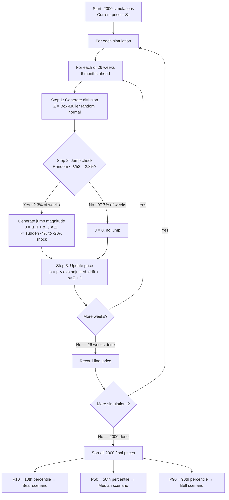

---

## 13. Appendix — Statistical Foundations

Detailed statistical breakdowns:
- Standard Deviation
- Normal Distribution and why finance breaks it
- Covariance, Correlation, and Beta
- Square Root of Time Rule
- EWMA (Exponential Weighted Moving Average)
- Variance Drag

---

## 14. Quick-Reference Cheat Sheet

| Metric | 🟢 Green (Good) | 🟡 Yellow (Caution) | 🔴 Red (Bad) | Key Question |
|--------|----------------|--------------------|-----------|----|
| **Max Drawdown** | > −20% | −20% to −40% | < −50% | Worst-case loss from peak? |
| **VaR 95% (Wk)** | > −5% | −5% to −10% | < −15% | Worst 5% of weeks? |
| **Sortino** | > 1.5 | 0.5–1.5 | < 0.5 | Return per downside risk? |
| **Sharpe** | > 1.0 | 0.5–1.0 | < 0.5 | Return per total risk? |
| **Beta** | 0.8–1.5 | 1.5–2.5 | > 3.0 | Market amplification? |
| **Alpha** | > +5% | −2% to +5% | < −5% | True outperformance? |
| **Omega** | > 1.5 | 1.0–1.5 | < 1.0 | Gains vs losses ledger? |

---

## RSU Decision Framework — Putting It All Together

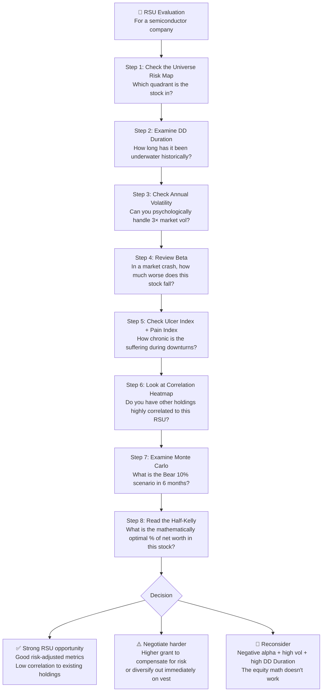

---

*Documentation for Career Semi Quant Terminal — Semiconductor Analytics Platform*

*All calculations use 18+ months of weekly closing prices. Risk-free rate: 4.5% (US 10-year Treasury proxy). Benchmark: S&P 500 ETF (SPY). All figures are backward-looking historical statistics — not forward projections or investment advice.*
